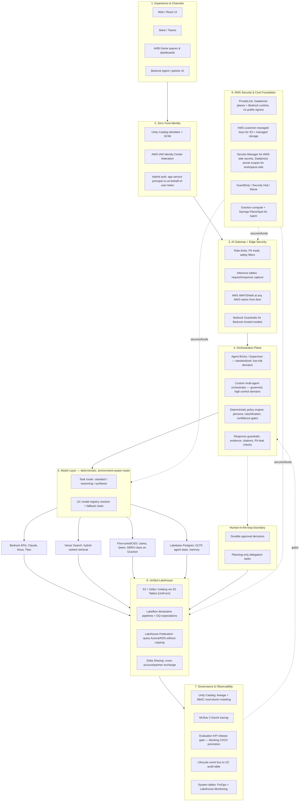

# ADR 0011: Augment the Compound AI Reference Blueprint with Databricks and AWS Leading-Edge Capabilities

## Status

Proposed

## Context

A generic "Databricks (Mosaic AI) inside AWS" Compound AI reference diagram was submitted for review:

```text
Application Layer
  -> Mosaic AI Gateway & Guardrails
  -> Agent Framework & Agent Bricks
  -> Model Serving Endpoints
  -> { Amazon Bedrock APIs | Databricks Vector Search | Fine-tuned OSS LLMs }
  -> Unified Data Lakehouse (S3 + Delta Lake)
  -> Governance & Observability (Unity Catalog + MLflow)
```

This project already has a target-state blueprint ([docs/ai-solution-blueprint.md](../ai-solution-blueprint.md)) and an as-built companion ([docs/ai-solution-current.md](../ai-solution-current.md)) that go materially further than the submitted diagram: zero-trust identity, split platform/domain guardrails, an orchestrator-selection framework, deterministic model routing, a durable lifecycle/audit event bus, and an evaluation KPI release gate. Those decisions are already recorded in ADRs 0002, 0004, 0005, 0006, 0007, 0008, 0009, and 0010.

Comparing the submitted diagram against those existing decisions and current Databricks/AWS platform capabilities surfaced two kinds of gaps:

1. Layers already decided and implemented in this repo, but missing from the submitted diagram.
2. Layers genuinely not yet decided or implemented anywhere in this repo.

### Gap summary

| Layer | Submitted diagram | Status in this repo |
| --- | --- | --- |
| Identity / zero trust | Absent | Implemented — [ADR 0002](0002-hybrid-auth-model.md) |
| Guardrails | Single flattened box | Implemented, split platform/domain — [ADR 0009](0009-unity-ai-gateway-for-llm-traffic.md), [ADR 0005](0005-governed-routing-policy-and-response-guardrails.md) |
| Orchestration | "Agent Bricks" only | Implemented, decision framework — [ADR 0008](0008-custom-orchestrator-vs-databricks-supervisor-agent.md) |
| Model routing | Static autoscaling | Implemented, deterministic + environment-aware — [ADR 0010](0010-environment-aware-model-routing.md) |
| Audit / observability | "MLflow tracing" only | Implemented, separate durable bus — [ADR 0004](0004-lifecycle-message-bus.md), [ADR 0006](0006-unity-catalog-audit-table-for-lifecycle-events.md) |
| Release gating | Not shown | Implemented, blocking KPI gate — [ADR 0007](0007-evaluation-kpi-release-gate.md) |
| Human approval boundary | Absent | Implemented — [docs/governance/human-in-the-loop.md](../governance/human-in-the-loop.md), [docs/ai-solution-current.md](../ai-solution-current.md) |
| AWS network/security hardening | Absent | Not implemented — new |
| Data-plane depth (federation, sharing, governed ingestion) | "S3 + Delta Lake" only | Not implemented — new |
| FinOps / cost + drift monitoring | Absent | Not implemented — new |
| Multi-provider model fan-out (Bedrock) | Shown as a peer branch, no caveats | Not implemented — new; has a known integration constraint (see Consequences) |

## Decision

Adopt the following augmented reference architecture as the target-state comparison baseline for this project's architecture reviews, superseding the submitted diagram as a review artifact. Where a layer already has an accepted ADR, this ADR defers to it and does not re-decide it. Where a layer has no accepted ADR, this ADR records it as tracked, proposed future work — not as an implemented decision.

### Adopted reference architecture



### Layer-by-layer disposition

| # | Layer | Disposition |
| --- | --- | --- |
| 1 | Experience & channels | No change required; multi-channel framing retained |
| 2 | Zero-trust identity | Already decided — ADR 0002 |
| 3 | AI Gateway + edge security | Platform half already decided — ADR 0009; AWS edge security (WAF/Shield/PrivateLink) is new, see Follow-up Work |
| 4 | Orchestration plane | Already decided — ADR 0008; domain guardrails already decided — ADR 0005 |
| — | Human-in-the-loop boundary | Already implemented — [docs/governance/human-in-the-loop.md](../governance/human-in-the-loop.md) |
| 5 | Model layer | Already decided — ADR 0010; multi-provider Bedrock fan-out is new, see Follow-up Work |
| 6 | Unified lakehouse | Storage decided implicitly (S3 + Delta already in use); Lakeflow/Federation/Sharing/S3 Tables depth is new, see Follow-up Work |
| 7 | Governance & observability | Already decided — ADR 0004, ADR 0006, ADR 0007; FinOps/System Tables/Lakehouse Monitoring is new, see Follow-up Work |
| 8 | AWS security & cost foundation | New, see Follow-up Work |

## Alternatives Considered

- Keep the submitted diagram as-is for future reviews. Rejected because it omits controls this project already treats as required (identity, split guardrails, release gating), and would misrepresent the project's actual governance posture to reviewers.
- Replace [docs/ai-solution-blueprint.md](../ai-solution-blueprint.md) wholesale with the submitted diagram. Rejected because the existing blueprint is more detailed and already cross-referenced from 8 other ADRs and the architecture guide.
- Adopt Databricks Agent Bricks / managed Supervisor Agent as the only orchestration model to match the submitted diagram's "Agent Framework & Agent Bricks" box. Rejected — already decided against for governed, high-control workflows in ADR 0008.
- Implement all new items (AWS hardening, data-plane depth, FinOps, Bedrock fan-out) immediately. Rejected — these are infrastructure and provider-integration commitments that need their own scoped ADRs and cost/risk sign-off before implementation, consistent with this repo's ADR update policy.

## Consequences

### Positive

- Gives reviewers one comparison artifact instead of conflating a generic external diagram with this project's actual governance posture.
- Makes explicit which architecture gaps are already closed (with ADR citations) versus genuinely open, preventing duplicate rediscovery of already-decided items.
- Establishes a named backlog (Follow-up Work) for AWS hardening, data-plane depth, FinOps, and multi-provider model routing, each scoped to become its own ADR at implementation time.

### Trade-offs

- This ADR documents a direction, not a deployed change; none of the "new" items are implemented by writing this record.
- Multi-provider fan-out to AWS Bedrock is constrained by a known platform limitation: Databricks-hosted Claude/Gemini served entities in this workspace reject Responses API passthrough (`400 BAD_REQUEST: Responses API passthrough is not supported for model <name>`), and the native AWS Bedrock `Converse` API tool-calling contract is not wire-compatible with the OpenAI Responses API tool-calling contract this orchestrator already uses. Any future Bedrock fan-out needs its own adapter, not a configuration change.
- Model names in the adopted diagram are illustrative; they must be treated as environment configuration ([ADR 0010](0010-environment-aware-model-routing.md)), not hardcoded architecture facts, to avoid the diagram going stale.

## Follow-up Work (requires its own ADR before implementation)

| Item | Candidate scope |
| --- | --- |
| AWS network/security hardening | PrivateLink for Databricks control/data plane, dedicated `bedrock-runtime` VPC endpoint, KMS customer-managed keys, GuardDuty/Security Hub/Macie over lakehouse storage |
| Secrets strategy reconciliation | AWS Secrets Manager for AWS-side infra secrets vs. Databricks secret scopes for workspace-side secrets, plus rotation/sync path |
| Data-plane depth | Lakeflow declarative pipelines with data-quality expectations, Lakehouse Federation against AWS RDS/Aurora sources, Delta Sharing for cross-account exchange, S3 Tables + Delta UniForm interop |
| FinOps and monitoring | System Tables-based cost dashboards, Lakehouse Monitoring for drift/quality, tied into the existing lifecycle message bus |
| Multi-provider model fan-out | AWS Bedrock (Claude, Nova, Titan) as an additional route with an explicit adapter for the Responses API / Converse API mismatch |

## Implementation Notes

- Source blueprint documents: [docs/ai-solution-blueprint.md](../ai-solution-blueprint.md), [docs/ai-solution-current.md](../ai-solution-current.md)
- Architecture guide: [docs/architecture/high-level-architecture.md](../architecture/high-level-architecture.md), [docs/architecture/README.md](../architecture/README.md)
- Referenced ADRs: [0002](0002-hybrid-auth-model.md), [0004](0004-lifecycle-message-bus.md), [0005](0005-governed-routing-policy-and-response-guardrails.md), [0006](0006-unity-catalog-audit-table-for-lifecycle-events.md), [0007](0007-evaluation-kpi-release-gate.md), [0008](0008-custom-orchestrator-vs-databricks-supervisor-agent.md), [0009](0009-unity-ai-gateway-for-llm-traffic.md), [0010](0010-environment-aware-model-routing.md)
- Human-in-the-loop reference: [docs/governance/human-in-the-loop.md](../governance/human-in-the-loop.md)
- No source code changes accompany this ADR; it is a review/decision record only.
