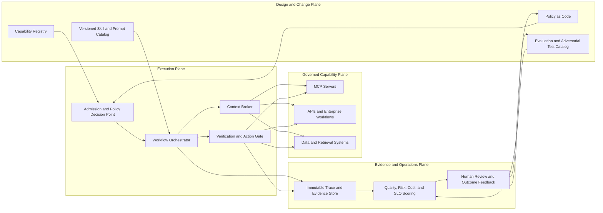
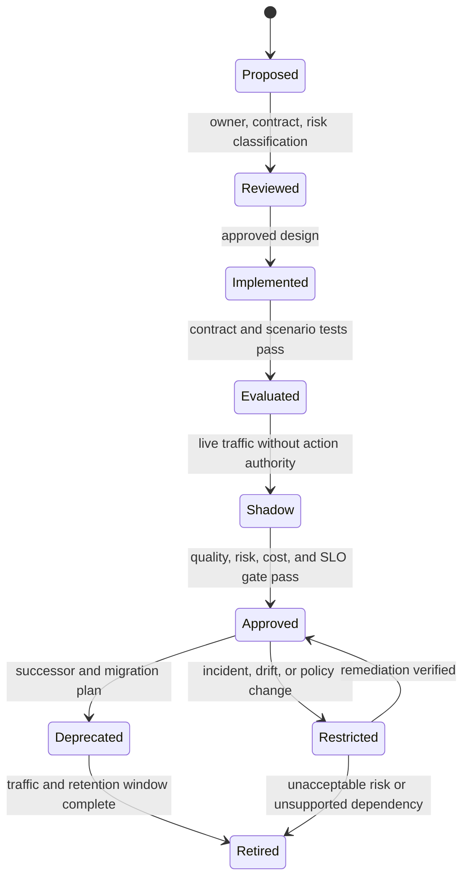
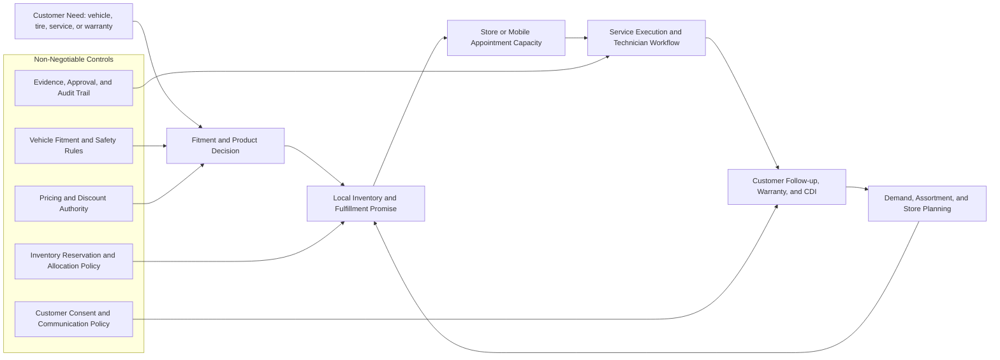

# AI Systems Architecture Blueprint

Enterprise Agentic AI Reference Architecture: Ontology, Context,
Skills, MCP, Tools, Governance, and Relevance Scoring

| **Drafted By** | Wenfei Chen |
| --- | --- |
| **Generated on** | August 5, 2026 |
| **Conversation scope** | Enterprise AI systems architecture blueprint |
| **Purpose** | Define a reusable enterprise blueprint for building governed, observable, secure, and operationally reliable AI systems. |

## Project Introduction

This repository, Governed-Multi-Agent-Intelligence-On-Databricks, is the current
implementation instance of this AI Systems Architecture Blueprint on the
Databricks platform. It operationalizes the blueprint into a deployable
multi-agent application with governed routing, runtime policy controls,
observability, and enterprise integration patterns.

In this implementation, Databricks provides the execution and operations
foundation for model access, tool orchestration, deployment targets,
evaluation workflows, and production governance. The source structure in
this project maps blueprint concepts into concrete assets across backend
runtime services, agent orchestration logic, API contracts,
configuration, tests, and deployment definitions.

This document is a reusable enterprise target-state blueprint. The project
is a working Databricks implementation instance used to validate and evolve
selected blueprint patterns. Current implementation authority is the
[architecture guide](architecture/README.md), especially the
[runtime technical specifications](architecture/runtime-technical-specs.md).

### Blueprint-to-Repository Cross-Reference

| Blueprint Section | Primary Repo Mapping |
| --- | --- |
| 2. Target Layered Architecture | `src/aiserver/`, `src/aiweb/src/`, `docs/architecture/high-level-architecture.md` |
| 3. Core Architecture Components | `src/aiserver/application/`, `src/aiserver/config/`, `src/aiserver/contracts/`, `src/aiserver/infrastructure/` |
| 4. Reference Workflow: Operational Investigation and Incident Decision | `src/aiserver/application/orchestration/`, `tests/test_orchestrator_service.py`, `tests/test_api_handlers.py` |
| 6. Context Engineering and Relevance Scoring Design | `docs/governance/business-semantics-metadata.md`, `docs/governance/data-contracts-lineage.md` |
| 7. Governance, Security, and Observability Model | `docs/governance/security-threat-model.md`, `tests/test_guardrails_service.py`, `tests/test_runtime_auth.py`, `tests/test_policy_service.py` |
| 8. Skill Catalog and Reusable Capability Model | `src/aiserver/README.md`, `src/operations/discover_tools.py`, `docs/architecture/tool-and-model-registry.md` |
| 9. Implementation Roadmap | `docs/operations/operations-runbook.md`, `docs/operations/mlflow-rollout-checklist.md`, `targets/` |
| 10. Additional Architecture Controls | `docs/adrs/`, `tests/test_message_bus_backends.py`, `tests/test_message_bus_integration.py` |

This table is intentionally concise and highlights the most direct
implementation anchors for each blueprint area.

## Blueprint Table of Contents

- [Project Introduction](#project-introduction)
- [Blueprint-to-Repository Cross-Reference](#blueprint-to-repository-cross-reference)
- [Summary](#summary)
- [Executive Alignment](#executive-alignment)
- [1. Architecture Purpose and Principles](#1-architecture-purpose-and-principles)
- [1.1 Guiding Principles](#11-guiding-principles)
- [2. Target Layered Architecture](#2-target-layered-architecture)
- [Architecture Decision Matrix](#architecture-decision-matrix)
- [3. Core Architecture Components](#3-core-architecture-components)
- [4. Reference Workflow: Operational Investigation and Incident Decision](#4-reference-workflow-operational-investigation-and-incident-decision)
- [5. Implementation Challenges and Mitigations](#5-implementation-challenges-and-mitigations)
- [6. Context Engineering and Relevance Scoring Design](#6-context-engineering-and-relevance-scoring-design)
- [6.1 Context Engineering Pipeline](#61-context-engineering-pipeline)
- [6.2 Relevance Scoring Model](#62-relevance-scoring-model)
- [7. Governance, Security, and Observability Model](#7-governance-security-and-observability-model)
- [8. Skill Catalog and Reusable Capability Model](#8-skill-catalog-and-reusable-capability-model)
- [9. Implementation Roadmap](#9-implementation-roadmap)
- [Phase 1: Foundation](#phase-1-foundation)
- [Phase 2: Governed Read-Only Capabilities](#phase-2-governed-read-only-capabilities)
- [Phase 3: Skills, Context Engineering, and Evaluation](#phase-3-skills-context-engineering-and-evaluation)
- [Phase 4: Controlled Write Actions and Human Approval](#phase-4-controlled-write-actions-and-human-approval)
- [Phase 5: Scale and Continuous Optimization](#phase-5-scale-and-continuous-optimization)
- [10. Additional Architecture Controls](#10-additional-architecture-controls)
- [11. Production-Grade Enhancements Compared with Industry-Leading AI Architecture](#11-production-grade-enhancements-compared-with-industry-leading-ai-architecture)
- [11.1 Agent Runtime and Orchestration](#111-agent-runtime-and-orchestration)
- [11.2 Evaluation Lifecycle](#112-evaluation-lifecycle)
- [11.3 MCP Security Threat Model](#113-mcp-security-threat-model)
- [11.4 Model Routing Strategy](#114-model-routing-strategy)
- [11.5 Memory Architecture](#115-memory-architecture)
- [11.6 Deployment Topology](#116-deployment-topology)
- [11.7 Operational SLOs](#117-operational-slos)
- [11.8 Production Readiness Scorecard](#118-production-readiness-scorecard)
- [11.9 Advanced Enterprise Agent Control Plane](#119-advanced-enterprise-agent-control-plane)
- [11.10 Capability Lifecycle and Change Governance](#1110-capability-lifecycle-and-change-governance)
- [11.11 Verification-First Execution Architecture](#1111-verification-first-execution-architecture)
- [11.12 Maturity Model and Investment Gates](#1112-maturity-model-and-investment-gates)
- [11.13 Tire Retail and Service Operating Model](#1113-tire-retail-and-service-operating-model)
- [12. Conclusion and Recommended Next Step](#12-conclusion-and-recommended-next-step)
- [13. Appendix: Source Reference Materials](#13-appendix-source-reference-materials)

## Summary

This blueprint defines a governed enterprise architecture for
production-ready AI systems. It connects business intent, agent
reasoning, reusable skills, engineered context, ontology, MCP-based
capability access, tools, and governance controls. Key benefits are
summarized below.

- **Governed enterprise access:** agents use approved capabilities
  instead of uncontrolled raw system access.

- **Reusable operational knowledge:** skills package repeatable
  workflows, templates, playbooks, and validation rules for consistent
  execution.

- **Higher-quality reasoning:** context engineering and relevance
  scoring improve evidence selection, reduce noise, and support more
  reliable decisions.

- **Shared business meaning:** ontology aligns agents, tools, metrics,
  systems, and users around common enterprise definitions.

- **Safer automation:** security, policy checks, confidence thresholds,
  and human approval gates reduce the risk of unauthorized or
  high-impact actions.

- **Production observability:** structured traces, tool-call logs,
  confidence scores, latency, and cost metrics make agent behavior
  auditable and support continuous improvement.

- **Scalable adoption model:** the layered design supports growth from
  read-only assistants to governed, production-grade agentic workflows.

The central principle is simple: agents should consume governed
capabilities, not raw system access. Skills define repeatable work;
context engineering supplies trusted evidence; ontology provides shared
meaning; MCP governs tool access; and security, observability,
evaluation, and human approval keep the system safe for enterprise use.

Target use cases include operational intelligence, incident triage,
platform governance, knowledge retrieval, ServiceNow support, change
advisory preparation, and AI-assisted architecture review.

## Executive Alignment

This blueprint aligns enterprise AI architecture decisions with business
value, engineering control, operational reliability, security, and
measurable adoption. It gives architecture, data engineering, platform
engineering, security, operations, and AI governance teams a shared
reference for designing production-grade agentic AI systems.

| Stakeholder Group | How the Blueprint Supports Alignment |
| --- | --- |
| Business and product leaders | Connects AI capabilities to business outcomes, adoption priorities, and measurable value. |
| Architecture and platform teams | Defines reusable layers, runtime patterns, MCP capability access, and production deployment expectations. |
| Data engineering and operations teams | Clarifies how context, ontology, observability, incident workflows, and operational controls support reliable AI-assisted execution. |
| Security and governance teams | Establishes least privilege, approval gates, tool governance, auditability, and policy enforcement as core design requirements. |
| AI delivery teams | Provides guidance for skills, evaluation, model routing, memory, deployment topology, and operational SLOs. |

## 1. Architecture Purpose and Principles

This blueprint provides an enterprise reference architecture for AI
systems that can reason, retrieve evidence, use approved tools, execute
governed workflows, and explain outcomes. It is intended for agents that
support operational intelligence, IT operations, data engineering,
analytics, knowledge retrieval, incident triage, and business decision
support.

### 1.1 Guiding Principles

The architecture follows eight principles: business capability first,
least privilege, reusable skills, governed context, evidence-backed
reasoning, human oversight for high-risk actions, observable execution,
and continuous evaluation. Agents should use approved capabilities
through governed interfaces with clear ownership, policies,
auditability, and lifecycle controls.

## 2. Target Layered Architecture

Read the architecture from top to bottom as a controlled path from
business request to governed system action. Each layer has one primary
responsibility, from intent capture through reasoning, skills, context,
ontology, MCP access, and tool execution.

| Layer | Primary Responsibility |
| --- | --- |
| Business Goals / User Intent | Define the business objective, constraints, and expected outcome. |
| Experience Layer | Capture intent through chat, documents, dashboards, workflow apps, and copilots. |
| Agent / Reasoning Layer | Plan, orchestrate, apply policy checks, and decide the next best action. |
| Skills Layer | Provide reusable procedures, playbooks, templates, examples, scripts, and validation rules. |
| Context Layer | Supply session context, operational context, memory, RAG evidence, and ranked context packages. |
| Ontology / Knowledge Layer | Define canonical entities, relationships, semantic rules, knowledge graph structure, and business meaning. |
| MCP / Capability Access Layer | Govern tool discovery, authorization, routing, schema validation, and controlled invocation. |
| Tool and Integration Layer | Execute approved operations through APIs, databases, Kafka, Flink, Databricks, ServiceNow, SAP, CRM, search, files, and operational systems. |
| Governance, Observability, Security, and Evaluation Plane | Apply cross-cutting controls across all layers. |

### Architecture Decision Matrix

| Architecture Area | Decision Guidance | Primary Control |
| --- | --- | --- |
| Agent access | Use governed capabilities instead of raw system access. | MCP gateway, authorization, audit trail |
| Workflow execution | Use stateful orchestration for multi-step or high-risk workflows. | Runtime checkpoints, retries, approval gates |
| Knowledge retrieval | Use ranked, trusted, and freshness-aware context packages. | Context scoring, metadata, source validation |
| Automation risk | Start read-only; introduce write actions only after governance approval. | Human approval, policy checks, rollback plan |
| Production readiness | Promote only workflows that meet measurable SLO and evaluation thresholds. | Readiness scorecard, CI/CD gates, observability |

## 3. Core Architecture Components

Together, the components form a controlled operating pattern: intent
defines the goal, the agent selects a skill, the skill drives the
workflow, context supplies evidence, ontology resolves meaning, MCP
exposes approved capabilities, and tools execute permitted actions.

**Business Intent and Experience Layer.** Captures user goals through
chat, workflow apps, dashboards, documents, or copilots and converts
them into structured objectives, constraints, outputs, and success
criteria.

**Agent and Reasoning Layer.** Decomposes goals, selects skills,
requests context, plans workflows, invokes governed capabilities,
evaluates evidence, and produces recommendations or approved actions
within bounded policies and confidence thresholds.

**Skills Layer.** Packages repeatable task knowledge into reusable
instructions, workflow steps, required tools, templates, examples,
validation rules, escalation criteria, and limitations.

**Context Engineering Layer.** Retrieves, ranks, compresses, structures,
and validates the minimum trusted evidence needed for a reliable
decision.

**Ontology and Knowledge Layer.** Defines canonical entities,
relationships, synonyms, metrics, rules, lineage, domains, and semantic
mappings so agents reason over shared enterprise meaning.

**MCP and Capability Access Layer.** Provides governed discovery and
invocation of approved capabilities. MCP should act as a capability
gateway, enforcing authentication, authorization, schema validation,
output filtering, rate limits, risk classification, and traceability
before tool execution.

## 4. Reference Workflow: Operational Investigation and Incident Decision

Example scenario: a user asks why WOM tire installation updates are
delayed for Store 125 and whether an incident should be opened. The
agent investigates the delay, identifies likely cause and business
impact, recommends next action, and prepares an explainable incident
summary if escalation is needed.

| Step | Workflow Activity |
| --- | --- |
| 1 | Capture user intent and impacted business entity, such as Store 125 and WOM updates. |
| 2 | Resolve entities through ontology, mapping WOM to Kafka topics, Flink jobs, Databricks tables, dashboards, and incident categories. |
| 3 | Load the relevant skill, such as Kafka/Flink Incident Triage Skill. |
| 4 | Retrieve and rank context: active alerts, recent deployments, lag metrics, checkpoint health, prior incidents, runbooks, and dashboard refresh state. |
| 5 | Discover approved tools through MCP, including query_kafka_lag, check_flink_health, query_databricks_load_status, search_incidents, and draft_servicenow_incident. |
| 6 | Execute read-only diagnostics first and collect evidence. |
| 7 | Reason over tool outputs and build a causal chain. |
| 8 | Score confidence, severity, and business impact. |
| 9 | If thresholds are met, draft an incident and request human approval before any high-risk write action. |
| 10 | Produce an explainable outcome with evidence, confidence, recommended actions, and trace ID. |

## 5. Implementation Challenges and Mitigations

Common risks include inconsistent definitions, uncontrolled context
growth, stale memory, tool sprawl, unreliable integrations, weak
permission governance, hallucinated reasoning, multi-agent conflict,
limited observability, high cost, and unclear ownership.

Mitigate these risks by treating AI systems as governed distributed
systems: use semantic governance, context engineering, managed memory,
MCP capability governance, production-grade tool contracts, zero-trust
security, verification before action, human approval for high-risk
decisions, and full telemetry.

Core rule: agents consume governed capabilities, not raw system access.
Each capability needs an owner, contract, schema, risk level,
authorization rule, test coverage, and observability.

## 6. Context Engineering and Relevance Scoring Design

Context engineering controls which information enters the agent's
reasoning window. Its goal is not to retrieve the most information; its
goal is to assemble the smallest reliable evidence package that is
relevant, fresh, trusted, complete, and affordable for the specific
decision or action.

### 6.1 Context Engineering Pipeline

> Context Engineering Pipeline:\
> User Request\
> -\> Intent and entity extraction\
> -\> Ontology resolution\
> -\> Candidate retrieval from documents, memories, incidents, metrics,
> logs, and tools\
> -\> Relevance, trust, freshness, entity, and completeness scoring\
> -\> Deduplication and clustering\
> -\> Compression and summarization\
> -\> Structured context package\
> -\> Agent reasoning and action planning\
> -\> Feedback and scoring improvement

### 6.2 Relevance Scoring Model

Use a composite relevance score instead of a single ranking metric.
Recommended signals include semantic similarity, lexical match, entity
match, ontology distance, recency, trustworthiness, completeness, prior
success, and token efficiency.

> Example Score:\
> Context Score = 0.30 x Semantic Relevance + 0.20 x Lexical Match +
> 0.15 x Entity Match + 0.15 x Freshness + 0.10 x Trustworthiness + 0.10
> x Ontology Distance.\
> \
> For incident triage, consider shifting weight toward Freshness,
> Trustworthiness, and Entity Match. For architecture Q&A, shift weight
> toward Semantic Relevance, Source Authority, and Version Currency.

## 7. Governance, Security, and Observability Model

**Governance.** Maintain registries for agents, skills, MCP servers,
tools, data sources, owners, risk classes, environments, and lifecycle
states. No capability should go live without ownership, authorization,
data classification, contract, approval status, monitoring, and rollback
path.

**Security.** Apply zero trust across the stack. Enforce user, agent,
and tool authorization; least privilege; sensitive-data filtering;
prompt-injection defenses; output masking; and human approval for
high-impact write actions.

**Observability.** Every agent run should emit structured traces
including request ID, agent name and version, selected skill, retrieved
context summary, ontology entities, MCP tools discovered, tool calls,
tool outputs, latency, token usage, cost, confidence score, final
status, escalation decision, and action outcome. These traces support
debugging, audit, model evaluation, compliance, and FinOps.

## 8. Skill Catalog and Reusable Capability Model

A Skill Catalog is the operating model for reusable AI capability. Each
skill should define its purpose, activation criteria, required inputs,
approved tools, workflow steps, constraints, validation checks, expected
outputs, owner, version, test cases, data sensitivity level, and
escalation rules. Skills allow specialized procedures to be reused
across multiple agents while limiting each agent to the capabilities it
is approved to use.

Example enterprise skills include Kafka/Flink Incident Triage,
Databricks Governance Review, ServiceNow Incident Communication
Drafting, Architecture Decision Review, Runbook Gap Analysis, Cost
Optimization Assessment, Knowledge Retrieval Q&A, and Change Advisory
Board Summary Drafting. High-risk skills should be approved, versioned,
tested, and monitored like production software.

## 9. Implementation Roadmap

### Phase 1: Foundation

Establish the architecture baseline, define the agent registry, identify
target use cases, create data and capability classification standards,
select the initial MCP gateway pattern, and document the first version
of the enterprise ontology for priority domains.

### Phase 2: Governed Read-Only Capabilities

Expose selected read-only capabilities through MCP, prioritize
operational diagnostics and knowledge retrieval, define tool contracts,
apply authorization and output filtering, instrument telemetry, and
validate results using benchmark prompts and operational scenarios.

### Phase 3: Skills, Context Engineering, and Evaluation

Build the initial Skill Catalog, implement context ranking and
compression, define relevance scoring profiles by workflow type, add
regression test suites, evaluate answer faithfulness and context
precision, and tune workflows using user feedback and resolution
outcomes.

### Phase 4: Controlled Write Actions and Human Approval

Introduce limited write operations such as incident drafting, ticket
creation, workflow updates, or change-request preparation only after
formal approval. Require schema validation, business-rule validation,
confidence thresholds, human approval, rollback planning, and audit
logging for each write-capable skill.

### Phase 5: Scale and Continuous Optimization

Scale the platform through federated domain ownership with central
guardrails. Add domain-specific skills, expand ontology coverage,
standardize evaluation harnesses, publish FinOps dashboards, track
adoption metrics, and continuously retire unused tools, stale context
sources, and outdated skills.

## 10. Additional Architecture Controls

**Reasoning Control.** AI systems must distinguish observed facts from
inferred conclusions. Any recommendation should be supported by
retrieved evidence, live tool results, source confidence, and explicit
uncertainty handling. The system should avoid taking action when
evidence is incomplete, contradictory, stale, or below the required
confidence threshold.

**Multi-Agent Control.** When multiple specialized agents participate in
a workflow, a central orchestrator should own task decomposition,
conflict resolution, shared state, final decision routing, and
escalation. Sub-agents should exchange structured findings and evidence
summaries rather than uncontrolled intermediate reasoning.

**Cost Control.** AI system design must include token budgeting, model
routing, caching, context compression, tool-call limits, retry limits,
and cost-per-workflow measurement. Cost should be observable at the
workflow, agent, skill, model, context source, and tool level.

**Operating Model Control.** The enterprise must define ownership for
ontology, skills, MCP servers, tool catalog, prompt templates, memory
stores, permissions, compliance reviews, release gates, incident
response, and lifecycle management. Without ownership and change
control, agentic AI platforms become difficult to trust, scale, or
operate.

## 11. Production-Grade Enhancements Compared with Industry-Leading AI Architecture

Compared with industry-leading agentic AI platforms, this blueprint
already covers the essential conceptual layers: business intent,
reasoning, skills, context, ontology, MCP-enabled capabilities, tools,
governance, security, observability, and evaluation. The
production-grade enhancements below close the remaining gap between a
reference architecture and an implementable enterprise platform by
adding runtime reliability, evaluation discipline, security threat
modeling, inference governance, memory controls, deployment topology,
and measurable operational service levels.

### 11.1 Agent Runtime and Orchestration

Production agent runtimes should be designed as stateful, resumable
workflows rather than simple prompt loops. The runtime should support
explicit workflow states, deterministic routing, bounded reasoning
loops, retries, timeouts, checkpointing, pause-and-resume behavior,
human approval checkpoints, and durable execution for long-running
tasks. Each workflow should define which agent owns the final decision,
when specialist agents are allowed to take over, how handoffs are
recorded, and how failed or partially completed tool calls are
recovered.

Recommended orchestration pattern: use a supervisor-agent model for
complex workflows, where the supervisor owns task decomposition,
routing, approval checkpoints, trace assembly, and final response
synthesis. Specialist agents should be limited to defined skills and
approved capabilities. For write actions, the runtime should enforce
idempotency keys, rollback planning, approval records, and post-action
verification.

### 11.2 Evaluation Lifecycle

Evaluation should be treated as a lifecycle discipline, not a one-time
test. Before deployment, each agent and skill should be evaluated
against curated datasets, trace-based scenarios, rubric evaluators,
safety evaluators, tool-call accuracy tests, groundedness checks, and
regression suites. During production, the platform should continuously
evaluate live traffic for task adherence, hallucination risk, policy
compliance, tool misuse, latency, cost, escalation accuracy, and user
outcome quality.

Minimum release criteria should include measurable thresholds such as
task adherence, groundedness pass rate, tool selection accuracy, tool
parameter correctness, policy violation rate, human override rate, and
production trace completeness. Evaluation results should be integrated
into CI/CD gates so prompt, skill, model, tool, or routing changes
cannot be promoted without passing quality and safety thresholds.

### 11.3 MCP Security Threat Model

MCP creates a major enterprise trust boundary because tool descriptions,
schemas, and tool results can influence agent behavior. The threat model
should explicitly cover tool poisoning, indirect prompt injection
through tool output, confused-deputy risk, excessive permissions, token
passthrough, rogue server registration, supply-chain compromise, tool
shadowing, data exfiltration through legitimate tool channels, message
replay, and sandbox escape.

Required controls should include MCP server allow-listing, server
ownership, version pinning, schema review, namespace isolation,
short-lived scoped tokens, user-bound authorization, per-tool least
privilege, runtime result sanitization, prompt-injection filtering,
immutable audit logs, transport security, sandboxing for local tools,
and re-review whenever a tool definition or server version changes.

### 11.4 Model Routing Strategy

Model routing should be a first-class architecture concern. Not every
workflow step needs the same model. A lower-cost model may be sufficient
for intent classification, entity extraction, simple summarization, and
routing decisions, while a stronger reasoning model may be reserved for
complex planning, multi-source synthesis, and high-impact
recommendations. Specialized models can support embedding, reranking,
code generation, SQL generation, safety classification, and evaluation.

The routing policy should define model selection criteria by task type,
risk level, latency budget, cost budget, context length, data
sensitivity, and required reasoning quality. The platform should support
fallback models, model version pinning, A/B testing, rollback,
per-workflow cost budgets, and monitoring of token usage, latency, error
rate, and output quality by model.

### 11.5 Memory Architecture

Memory should be separated into distinct types with different trust
levels and retention rules: working memory for the current task, session
memory for the current conversation, user preference memory,
organizational memory for policies and runbooks, semantic memory through
ontology and knowledge graphs, episodic memory for prior agent runs and
decisions, and operational memory for metrics, incidents, deployments,
and system events.

The memory layer must include retention policies, deletion procedures,
privacy controls, source attribution, staleness detection, poisoning
prevention, and trust hierarchy. Agents should not treat memory as
automatically authoritative. Memory should be retrieved, scored,
validated, and compared with current source-of-record evidence before it
influences decisions or actions.

### 11.6 Deployment Topology

The logical architecture should map to a deployable platform topology.
Recommended components include an experience layer, agent runtime
service, skill registry, prompt registry, MCP gateway tier, tool adapter
services, vector search index, knowledge graph or ontology store,
evaluation service, observability pipeline, policy engine, secrets
manager, identity provider integration, CI/CD gates, and
environment-specific configuration for DEV, UAT, and PROD.

Production deployment should enforce network isolation, private
connectivity to enterprise systems, managed identities, secrets
rotation, centralized logging, trace export, infrastructure-as-code,
automated policy checks, and blue-green or canary release patterns for
agent, skill, model, and tool changes. Environments should remain
isolated so development agents cannot access production data or
production write-capable tools.

### 11.7 Operational SLOs

Operational readiness should be measured with explicit service-level
objectives. Recommended SLO categories include availability, p95
response latency, tool-call success rate, retrieval freshness, context
precision, groundedness pass rate, task completion rate, policy
violation rate, hallucination defect rate, escalation accuracy, human
approval turnaround time, trace completeness, cost per workflow, token
usage per workflow, and incident recovery time for agent failures.

Recommended operating practice: publish an AI agent readiness scorecard
for every production workflow. The scorecard should include release
criteria, current SLO performance, open risks, approved capabilities,
evaluation results, known limitations, rollback path, on-call owner, and
review cadence. This makes AI systems manageable as production services
rather than isolated experiments.

### 11.8 Production Readiness Scorecard

| Readiness Area | Minimum Expectation | Evidence Required |
| --- | --- | --- |
| Evaluation | Workflow passes quality, safety, and regression thresholds. | Evaluation report, failed-case review, approval record |
| Security | Tools, MCP servers, and data sources are approved and least-privileged. | Access review, data classification, threat model |
| Observability | Every run emits complete traces, metrics, cost, and tool-call logs. | Dashboard, trace sample, alert policy |
| Operations | Ownership, escalation, rollback, and incident response are documented. | Runbook, on-call owner, rollback procedure |
| Governance | Agent, skill, model, and capability changes follow release gates. | Change record, approval workflow, version history |

### 11.9 Advanced Enterprise Agent Control Plane

At enterprise scale, the agent runtime should be governed by a control
plane instead of scattered configuration, prompts, and deployment
scripts. The control plane makes capability admission, runtime policy,
evaluation, and rollback independently reviewable. It does not replace
domain teams; it gives them a common contract for publishing governed
capabilities.

The control plane should publish these versioned artifacts:

| Artifact | Required content | Admission decision |
| --- | --- | --- |
| Capability registration | Owner, interface, data classification, auth mode, risk, cost, freshness, SLO, and rollback method | Approved capability may be discovered by eligible skills. |
| Skill release | Inputs, allowed capabilities, decision boundaries, output schema, evaluation set, and escalation rules | Skill can be routed only after passing its defined gate. |
| Policy release | Persona, data, tool, model, retention, and action constraints expressed as testable rules | Runtime uses the versioned policy decision for each request. |
| Model release | Approved model versions, supported tasks, context limits, safety profile, cost limits, and fallback order | Model becomes eligible for a route only after evaluation and security review. |
| Retrieval release | Corpus/version, chunking, metadata contract, access policy, freshness target, and evaluation set | Context source becomes eligible only with provenance and quality evidence. |

Policy enforcement should have both a decision point and enforcement
points. The decision point computes allow, deny, require-approval, or
require-verification decisions. Enforcement points exist at request
admission, context retrieval, tool invocation, output release, and
write-action execution. This avoids treating an orchestrator prompt as
the sole security boundary.

### 11.10 Capability Lifecycle and Change Governance

Every agent, MCP server, data source, model route, prompt, and skill
should follow the same lifecycle. A capability is not production-ready
because it can be called; it must prove a bounded purpose, accountable
owner, tested contract, and reversible operating path.

Required lifecycle controls:

- Assign a business owner, technical owner, on-call owner, and data owner.
- Record a semantic contract: intent, inputs, outputs, evidence source,
  freshness target, uncertainty behavior, and prohibited actions.
- Test the capability in isolation and as part of representative
  multi-tool workflows.
- Run new model, prompt, skill, and retrieval releases in shadow or
  canary mode before granting action authority.
- Attach a kill switch, rollback procedure, dependency health check, and
  deprecation plan to every production capability.
- Re-certify access, quality, and ownership on a scheduled cadence and
  whenever a material schema, model, policy, or data-classification
  change occurs.

### 11.11 Verification-First Execution Architecture

For consequential recommendations and all write-capable workflows, the
system should separate planning from execution. Models can propose a
plan, but deterministic and independently auditable checks decide
whether the plan may proceed. The agent must preserve evidence and
action intent throughout this path.

| Stage | Model responsibility | Deterministic responsibility | Output |
| --- | --- | --- | --- |
| Interpret | Parse request, intent, entities, and desired outcome | Validate input shape, identity, and policy scope | Bounded task objective |
| Plan | Propose capability sequence and expected evidence | Verify capability allow-list, budget, and delegation depth | Executable plan or denial |
| Gather | Select and summarize evidence | Enforce source authorization, freshness, provenance, and quotas | Evidence package |
| Decide | Draft recommendation or action parameters | Validate schema, business rules, confidence, and required evidence | Verified proposal |
| Authorize | Explain impact and request review when needed | Apply risk threshold, segregation of duties, and approval policy | Approved, rejected, or paused action |
| Execute | None for irreversible action; model may observe result | Invoke idempotent action, record receipt, and verify postcondition | Action receipt and outcome |
| Learn | Summarize outcome and propose evaluation cases | Redact, retain, score, and route feedback under policy | Governed learning signal |

High-risk actions should use a transactional outbox or equivalent durable
command record. The record binds the approved action parameters, policy
version, evidence identifiers, approver, idempotency key, execution
receipt, and postcondition result. This creates a reliable boundary
between advisory reasoning and operational change.

### 11.12 Maturity Model and Investment Gates

The blueprint supports incremental adoption. Do not advance a workflow
to a higher maturity level until it demonstrates the evidence required
at the preceding level.

| Level | Operating capability | Required evidence to advance |
| --- | --- | --- |
| 0. Experiment | Prompt-driven prototype with synthetic or public data | Named owner, documented limitation, and no production action authority |
| 1. Governed read | Authenticated retrieval and read-only tools with audit traces | Access review, source provenance, baseline evaluation, and incident owner |
| 2. Reliable decision support | Evidence-backed recommendations with deterministic routing and guardrails | Groundedness, tool correctness, latency/cost baseline, and human outcome review |
| 3. Controlled workflow | Bounded multi-step tasks, durable state, and human approval for consequential actions | Idempotency, recovery test, segregation of duties, rollback procedure, and action audit |
| 4. Managed autonomy | Narrow pre-approved actions with continuous monitoring and automatic containment | Stable SLOs, drift detection, periodic re-certification, kill-switch drill, and accountable business owner |

Investment should be governed by workflow value and risk, not novelty.
Prioritize the smallest set of capabilities that materially improve an
observable business outcome. Increase autonomy only when the system has
earned it through evidence of safe, reliable, and cost-effective
operation.

### 11.13 Tire Retail and Service Operating Model

For a tire retailer and service operator such as Discount Tire, the
highest-value AI workflows sit where customer demand, vehicle safety,
store capacity, local inventory, fulfillment, and field execution meet.
The target architecture should improve associate and operator decisions
without allowing a model to override fitment rules, safety procedures,
price authority, payment controls, or technician judgment. This section
describes industry-aligned target-state guidance; it does not claim that
these capabilities or data sources are implemented in this repository.

#### Domain Value Chain

The enterprise ontology should model at least the following governed
entities and relationships:

| Domain | Canonical entities | High-value relationships and controls |
| --- | --- | --- |
| Vehicle and fitment | VIN, year/make/model/trim, tire size, load index, speed rating, wheel, TPMS, fitment rule | Vehicle-to-approved fitment; compatible substitutions; prohibited fitment; source and effective date of fitment data |
| Product and pricing | Tire, brand, SKU, service package, promotion, warranty, competitor price | Product-to-fitment eligibility; price authority; promotion eligibility; margin guardrail; expiration and regional applicability |
| Inventory and fulfillment | Store, distribution center, stock position, reserved quantity, transfer, supplier ETA, order | Available-to-promise after reservations; transfer lead time; substitution policy; no promise beyond verified supply |
| Service operations | Appointment, bay, technician role, work order, service duration, mobile unit, queue | Capacity-aware commitment; skill/equipment requirement; safety inspection dependency; no autonomous schedule override |
| Customer and experience | Customer, vehicle, communication preference, warranty claim, CDI signal, recovery case | Consent and retention rules; evidence-backed recovery recommendation; protected customer attributes excluded from routing |
| Store performance | Store, region, demand signal, conversion, units, margin, appointment volume, CDI | Comparable-store peer group; freshness window; confidence interval; explicit separation of observation from recommendation |

Fitment, torque specifications, TPMS procedures, recall notices, and
safety-service requirements should be treated as controlled source-of-
truth data, not RAG-only content. The agent may explain an approved rule
and collect missing information, but a deterministic fitment service or
certified catalog must make the final compatibility decision. Every
customer-facing recommendation should disclose the vehicle attributes,
approved products, price/availability timestamp, and any assumptions
that require associate confirmation.

#### Practical Capability Sequence

Start with workflows that reduce search, handoffs, and diagnosis time
without changing customer commitments or operational records. Promote
only after measurable quality and business evidence are established.

| Priority | Capability | Leading-edge element | Pragmatic first release | Required guardrails and measures |
| --- | --- | --- | --- | --- |
| 1 | Store operations copilot | Cross-source reasoning over appointments, orders, inventory, and CDI | Read-only answers for open appointments, order state, store demand, and service exceptions | Source freshness, persona authorization, appointment/order data minimization, time-to-answer and tool correctness |
| 2 | Associate fitment assistant | Multimodal vehicle/document understanding and explanatory recommendations | Guided intake that retrieves deterministic fitment results and approved product alternatives | Certified fitment source, no free-text compatibility decision, VIN/PII masking, recommendation acceptance and correction rate |
| 3 | Inventory and fulfillment exception manager | Predictive ETA and transfer optimization | Explain stock-outs, locate eligible inventory, and draft transfer/escalation recommendations | Reservation-aware available-to-promise, human approval for allocation, promise accuracy, transfer cancellation and fulfillment rate |
| 4 | Appointment and labor-capacity planner | Forecasting and constrained optimization | Identify overbooked days, queue risks, and candidate rescheduling options | No autonomous booking change, consent before customer contact, bay/skill constraints, wait-time and no-show impact |
| 5 | Customer recovery planner | Causal and next-best-action models informed by CDI and service history | Evidence-backed manager packet for stores with sales/CDI/service risk | Human approval, fairness review, no protected-class targeting, CDI uplift and complaint recurrence |
| 6 | Field and streaming incident copilot | Event-driven diagnosis from order, fulfillment, and installation telemetry | Detect and summarize delayed WOM/Flink/data pipeline updates for engineering triage | Read-only diagnostics first, incident evidence package, false-alert rate, mean time to detect and recover |

The current project already provides a pragmatic foundation for the
first and sixth capabilities: governed tool routing, sales/CDI and
operational data access, Flink support retrieval, evidence controls,
manager approval, lifecycle audit, and evaluation gates. The active
integration inventory remains in the [Tool and model registry](architecture/tool-and-model-registry.md).

#### Leading-Edge Architecture, Applied Pragmatically

Leading-edge techniques should improve decision quality without making
the initial system harder to operate:

- **Event-driven operational context:** combine near-real-time order,
  appointment, inventory, and service events into freshness-labeled
  context packages. Use streaming alerts for exceptions, but retain a
  human-readable source snapshot for every decision.
- **Constraint-aware optimization:** use optimization or rules engines
  for inventory allocation, appointment capacity, and route planning;
  use the LLM to explain options, gather constraints, and draft a
  recommendation rather than to solve safety or allocation constraints
  unaided.
- **Multimodal assisted intake:** use image/document models only to
  extract candidate tire sidewall, damage, invoice, or vehicle details.
  Require confidence thresholds and associate review before those fields
  affect fitment, pricing, warranty, or service decisions.
- **Digital store and service twin:** model stores, bays, local demand,
  inventory, staffing, and fulfillment flows for simulation. Start with
  what-if planning and exception prioritization before automated
  optimization.
- **Causal experimentation:** evaluate interventions such as staffing,
  appointment-slot changes, or recovery offers against holdout stores or
  cohorts. Do not treat correlations between sales, CDI, and demand as
  proof that an intervention caused an outcome.
- **Outcome-grounded learning:** join agent recommendations with
  approved actions and measured outcomes. Use redacted, policy-approved
  feedback to improve evaluation sets, not unreviewed production text as
  direct training data.

#### Safety, Consumer, and Operational Boundaries

| Decision class | Agent role | Required independent control |
| --- | --- | --- |
| Product discovery and education | Explain verified product attributes and collect requirements | Current catalog, price, availability, and disclosure timestamp |
| Vehicle fitment and safety | Retrieve certified rule result and explain it | Deterministic fitment validator; associate or technician confirmation for exceptions |
| Appointment recommendation | Propose options within verified capacity | Customer consent and scheduling-system confirmation |
| Inventory transfer or reservation | Draft recommendation and impact statement | Inventory policy engine plus authorized human approval |
| Discount, refund, or warranty exception | Prepare evidence package | Delegated price/refund authority and policy approval |
| Service procedure or repair | Summarize approved procedure | Technician judgment, safety checklist, and work-order verification |
| Customer communication | Draft compliant message | Consent, channel preference, brand/legal review, and approved send path |

The default for any uncertainty in fitment, safety, price, reservation,
warranty, or repair is to pause, disclose the missing evidence, and route
to an authorized associate or technician. This is both safer and more
practical than designing a broad autonomous agent.

## 12. Conclusion and Recommended Next Step

This blueprint establishes a foundation for scaling AI systems from
isolated assistants into governed enterprise capabilities. The
recommended next step is to select one high-value read-only workflow,
define its ontology scope, publish the required MCP capabilities, create
the first production skill, and evaluate the workflow using measurable
quality, safety, cost, and adoption metrics.

## 13. Appendix: Source Reference Materials

| **Reference Category** | **Supporting Material** |
| --- | --- |
| Agentic AI design patterns | DT_Agentic_Design_Patterns_v1.docx — enterprise agent design, reusable skills, orchestration, and governed AI operating patterns |
| MCP implementation planning | DT_MCP_Server_Internal_Build_Plan_v1.docx — internal MCP gateway, tool exposure, capability registration, and governance planning |
| Enterprise AI governance | EA_Strategy_Agent_Integration_MCP_Governance_Brief.docx — governance model for agent integration, MCP controls, and enterprise adoption |
| AI Center of Excellence materials | AI COE - Executive Presentation - Gary with Scott Changes.pptx — executive AI strategy, adoption themes, and governance messaging |
| MCP architecture overview | Model Context Protocol architecture overview — capability discovery, tool invocation, and integration architecture concepts |
| Context governance and trust hierarchy | DT_Agentic_Design_Patterns_v1.docx — trust hierarchy, context window management, evidence ranking, and context quality controls |
| Evaluation harness engineering | DT_Harness_Engineering_v1.docx — evaluation harness design, quality gates, regression testing, and agent reliability measurement |
| External RAG evaluation guidance | External RAG evaluation references — retrieval quality, groundedness, ranking, and answer faithfulness considerations |
| Hybrid RAG architecture | real_time_hybrid_rag_mvp_report_20260620_194617.pdf — hybrid retrieval architecture, graph-enhanced RAG, and real-time context patterns |
| Agentic RAG and metadata design | DT_Agentic_Design_Patterns_v1.docx — agentic RAG patterns, chunk metadata, and retrieval context controls |
| RAG chunking strategy | RAG_Chunking_Strategies.pptx — chunking methods, retrieval boundaries, metadata design, and quality considerations |
| Agent provisioning design | p360_agent_provisioning_fdd.docx — agent provisioning, lifecycle management, and operational onboarding requirements |
| Hybrid retrieval and reranking | Hybrid search reference — BM25, vector retrieval, reranking, and retrieval quality tradeoffs |
