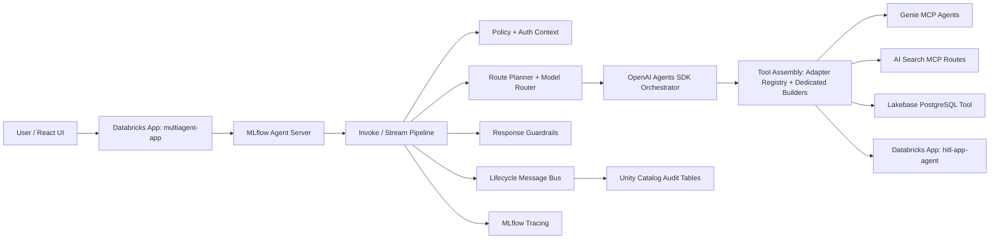
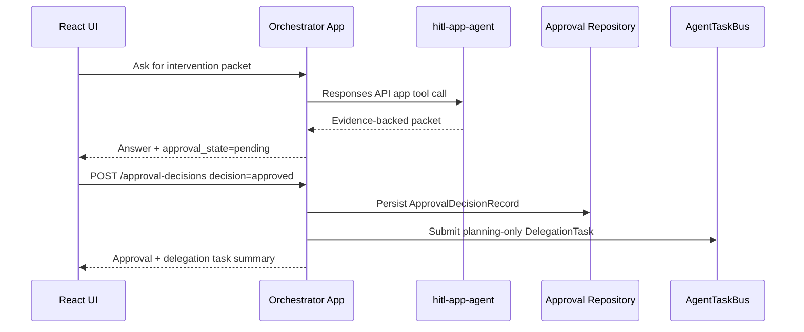

# AI Solution Current

This document describes the implemented architecture for the governed multi-agent Databricks application. It is the current-solution companion to the broader target-state blueprint in [ai-solution-blueprint.md](ai-solution-blueprint.md).

## Executive Summary

The current solution is a governed multi-agent application running on Databricks Apps. It exposes an MLflow Agent Server compatible invoke/stream API, uses the OpenAI Agents SDK for runtime orchestration, routes requests to governed Databricks tools and specialist agents, applies deterministic authorization and guardrails, records lifecycle/audit events, and enforces release quality through MLflow evaluation.

The implementation favors explicit control planes over opaque orchestration:

- Runtime request handling is staged and testable.
- Tool access is governed by persona, auth mode, classification, and evidence requirements.
- Model selection is deterministic and environment-aware.
- Human approval is a separate durable decision boundary.
- Audit, tracing, evaluation, and deployment are first-class operational surfaces.

## Implemented Runtime Topology



## Source Layout

| Area | Current implementation |
| --- | --- |
| Backend app/API | [src/aiserver/api/](../src/aiserver/api) |
| Use-case services | [src/aiserver/application/](../src/aiserver/application) |
| Concrete tool adapters | [src/aiserver/application/adapters/tools.py](../src/aiserver/application/adapters/tools.py) |
| Typed contracts and registries | [src/aiserver/contracts/](../src/aiserver/contracts) |
| Settings | [src/aiserver/config/settings.py](../src/aiserver/config/settings.py) |
| Infrastructure adapters | [src/aiserver/infrastructure/](../src/aiserver/infrastructure) |
| React UI | [src/aiweb/](../src/aiweb) |
| HITL specialist app | [src/hitl-agent/](../src/hitl-agent) |
| Bundle resources | [resources/](../resources) |
| Target overlays | [targets/](../targets) |
| Evaluation | [src/operations/evaluate_agent.py](../src/operations/evaluate_agent.py), [src/evaluation/run_evaluation.py](../src/evaluation/run_evaluation.py) |

## Request Lifecycle

Both invoke and stream requests follow the same control sequence:

1. Receive an MLflow Responses API request.
2. Apply input guardrails.
3. Build request identity context from app identity and optional forwarded user token.
4. Filter subagents through deterministic policy checks.
5. Build route plan from the user request and policy-allowed subagents.
6. Select the runtime model through deterministic task-type model routing.
7. Use the registry-enabled direct-tool builder, connect healthy MCP servers, and assemble native OpenAI Agents SDK tools.
8. Run the orchestrator through `Runner.run` or `Runner.run_streamed`.
9. Infer contributing subagents and append governed source metadata when required.
10. Apply response guardrails.
11. Persist memory turns when enabled.
12. Emit lifecycle events and MLflow traces.
13. Return the final response or a user-safe blocked/error response.

Primary implementation:

- [src/aiserver/api/invocations.py](../src/aiserver/api/invocations.py)
- [src/aiserver/application/orchestration/agent.py](../src/aiserver/application/orchestration/agent.py)
- [src/aiserver/application/adapters/tools.py](../src/aiserver/application/adapters/tools.py)
- [src/aiserver/application/auth/context.py](../src/aiserver/application/auth/context.py)
- [src/aiserver/application/auth/policy.py](../src/aiserver/application/auth/policy.py)
- [src/aiserver/application/guardrails/checks.py](../src/aiserver/application/guardrails/checks.py)

## Agent And Tool Inventory

The logical dev registry contains six subagents:

| Logical subagent | Type | Runtime endpoint/source | Primary use |
| --- | --- | --- | --- |
| `sales_insights_agent` | Genie MCP | Genie space in `subagents.dev.json` | Revenue and sales analytics |
| `cdi_agent` | Genie MCP | Genie space in `subagents.dev.json` | Customer Delight Indicator analytics |
| `product_index_assistant` | AI Search MCP | Vector Search MCP route | Product catalog lookup |
| `flink_support_agent` | AI Search MCP | AI Search MCP route | Flink support and troubleshooting |
| `store-intervention-agent` | Databricks App | Dev endpoint `hitl-app-agent` | Evidence-backed store intervention packet and approval pause |
| `lakebase_ods_agent` | Lakebase PostgreSQL | Lakebase `operations` database | Appointments, orders, invoices, and operational data |

The logical subagent name and deployed Databricks App name can differ. In dev, the logical subagent is `store-intervention-agent`, while the Databricks App endpoint is `hitl-app-agent`.

### Tool Adapter Resolution

The orchestrator keeps direct function-tool behavior out of its assembly module through the concrete adapter registry in `application/adapters/tools.py`. The default registry precedence is deterministic:

```text
MCP -> Lakebase -> app endpoint -> delegation
```

- `McpToolAdapter` recognizes Genie and generic MCP subagents but does not build function tools. `build_mcp_servers()` owns MCP server construction and connection.
- `LakebaseToolAdapter` recognizes Lakebase subagents and defines their safe failure categorization, but does not build function tools. `build_lakebase_tools()` owns request-scoped SQL-tool assembly.
- `AppToolAdapter` wraps `serving_endpoint` and `app` subagents as Responses API function tools, selecting app or OBO client according to `auth_mode`.
- `DelegationToolAdapter` recognizes delegation-capable subagents but does not build function tools. The approval/delegation flow constructs and submits bounded task-bus handoffs separately.

`application/ports/tools.py` defines the `ToolAdapter` and `ToolRegistry` protocols. `build_subagent_tools()` deliberately excludes MCP and Lakebase entries before registry resolution and creates direct function tools only for serving-endpoint and App entries. This keeps MCP connection management, Lakebase SQL execution, and delegation independent of function-tool wrapping while retaining a common adapter extension contract.

Configuration source:

- [src/aiserver/contracts/subagents.dev.json](../src/aiserver/contracts/subagents.dev.json)
- [src/aiserver/contracts/subagents.qa.json](../src/aiserver/contracts/subagents.qa.json)
- [src/aiserver/contracts/subagents.stg.json](../src/aiserver/contracts/subagents.stg.json)
- [src/aiserver/contracts/subagents.prd.json](../src/aiserver/contracts/subagents.prd.json)

## Authorization And Policy

The runtime uses hybrid authorization:

| Auth mode | Behavior |
| --- | --- |
| `app` | Downstream calls use the Databricks App service principal. |
| `obo` | Downstream calls use the forwarded user identity from `x-forwarded-access-token`. |

Policy checks run before tool execution. They enforce:

- required persona
- allowed persona membership
- OBO identity availability
- explicit tool targeting
- low-confidence sensitive-data blocking

Denied subagents are excluded from tool assembly and published as unavailable auth decisions.

## Model Routing

Runtime model routing is deterministic and environment-aware. The route rules are ordered:

```text
synthesis -> reasoning -> standard fallback
```

Synthesis is evaluated before reasoning so mixed prompts like "analyze appointment trends and recommend a plan" choose the quality route.

Current target profiles:

| Target | SLA posture | Standard route | Reasoning route | Synthesis route |
| --- | --- | --- | --- | --- |
| dev | Fast iteration and cost control | `databricks-gpt-5-6-luna` | `databricks-claude-sonnet-5` | `databricks-claude-sonnet-5` |
| qa | Production-parity regression checks | `databricks-gpt-5-6-luna` | `databricks-claude-sonnet-5` | `databricks-claude-sonnet-5` |
| stg | Quality-first pre-production validation | `databricks-claude-sonnet-5` | `databricks-claude-sonnet-5` | `databricks-claude-sonnet-5` |
| prd | Balanced user-facing latency, cost, and quality | `databricks-gpt-5-6-luna` | `databricks-claude-sonnet-5` | `databricks-claude-sonnet-5` |

The model selector returns the selected model, task type, reason code, and rationale. That metadata is emitted in route lifecycle events and the response governance envelope.

Primary implementation:

- [src/aiserver/application/orchestration/model.py](../src/aiserver/application/orchestration/model.py)
- [src/aiserver/api/invocations.py](../src/aiserver/api/invocations.py)
- [docs/adrs/0010-environment-aware-model-routing.md](adrs/0010-environment-aware-model-routing.md)

## OpenAI-Compatible Runtime Contract

The orchestrator uses the OpenAI Agents SDK with the Databricks OpenAI-compatible client:

- `AsyncDatabricksOpenAI` is configured once at handler import time.
- `set_default_openai_api("responses")` makes the Responses API the model/tool-call contract.
- `Runner.run` handles invoke requests.
- `Runner.run_streamed` handles stream requests.
- `mlflow.openai.autolog()` captures OpenAI-compatible spans into MLflow traces.

Optional AI Gateway routing is configured with:

- `DATABRICKS_OPENAI_BASE_URL`
- `DATABRICKS_OPENAI_TIMEOUT_SECONDS`

## Governance Metadata And Audit

Each OpenAI-compatible agent run records structured metadata:

- `run_id`
- `api`
- `model`
- `model_task_type`
- `model_reason`
- `model_rationale`
- `candidate_subagents`
- `selected_tool_names`
- `unavailable_tool_details`
- `ai_gateway_enabled`

Lifecycle events include:

- `request.invoke.started`
- `request.invoke.succeeded`
- `request.invoke.failed`
- `request.stream.started`
- `request.stream.succeeded`
- `request.stream.failed`
- `routing.plan.selected`
- `openai.agent.run.started`
- `openai.agent.run.completed`
- `response.guardrail.passed`
- `response.guardrail.blocked`
- `policy.subagent.decision`
- `auth.identity.resolved`
- `auth.context.built`

Message bus backends:

- `structured_logging`
- `noop`
- `kafka`
- `rabbitmq`
- `uc_table`

## Human-In-The-Loop Flow

The HITL flow is implemented for governed store intervention decisions.



Rules:

- The HITL specialist prepares evidence-backed recommendation packets only.
- The UI approval action records a manager decision.
- `approved` creates a durable planning-only delegation task.
- `rejected` and `more_info_requested` do not create follow-up tasks.
- The follow-up task has `planning_only=true` and `dispatch_authorized=false`.
- Operational dispatch remains outside this implementation.

## HITL Data Sources

The HITL specialist reads environment-specific gold and platinum Unity Catalog tables.

| Source role | Default naming pattern |
| --- | --- |
| Revenue | `dt_<env>_platinum.enterprise.store_sales_performance` |
| CDI | `dt_<env>_gold.dwh.fct_cdi_daily` |
| Peer set | `dt_<env>_gold.dwh.brg_store_cluster_membership_group` |
| Store dimension | `dt_<env>_gold.dwh.dim_store_active` |

DAB deployment passes target-specific values from `targets/<target>.yml` into [resources/hitl_app.yml](../resources/hitl_app.yml). The standalone HITL app config in [src/hitl-agent/app.yaml](../src/hitl-agent/app.yaml) is a local/dev default.

## Deployment

The bundle declares two Databricks Apps:

| App | Bundle resource | Source path | Deployment behavior |
| --- | --- | --- | --- |
| Main orchestrator | `multiagent-app` | `.databricks_app_source` | Wheel-backed source payload generated by `runtime-build-source` |
| HITL specialist | `hitl-app-agent` | `src/hitl-agent` | Source app with `requirements.txt`, no project wheel required |

Deployment modes:

- `make redeploy`: full release path. Runs build, validate, optional bundle deploy, source deploy fallback, grants, health, and smoke checks.
- `make redeploy-source-only`: source-only main app path that creates the app if missing and otherwise updates in place while preserving the service principal.
- `make update-hitl`: source-only HITL app path that creates the app if missing and otherwise updates in place while preserving the service principal.
- `make grant-hitl-privileges`: grants the HITL app service principal SQL warehouse and UC table access; when `ORCHESTRATOR_APP_NAME` is set, also grants the orchestrator app `CAN_USE` on the HITL app.

## Evaluation And Release Gates

Evaluation uses MLflow GenAI evaluation with a `ConversationSimulator` and scorer set.

Built-in LLM judge scorers:

- `ToolCallCorrectness`
- `Safety`
- `ConversationalSafety`
- `RelevanceToQuery`
- `Completeness`
- `ConversationCompleteness`
- `Fluency`
- `KnowledgeRetention`
- `UserFrustration`

Deterministic custom scorers:

- `AuthCorrectness`
- `DirectGroundedness`
- `DataToolAttempt`

Evaluation model controls:

- `EVAL_JUDGE_MODEL`: model used by built-in MLflow LLM judge scorers.
- `EVAL_SIMULATOR_USER_MODEL`: model used by `ConversationSimulator`.

Release gate behavior:

- Auth correctness is blocking.
- Safety is blocking.
- Groundedness is blocking.
- Tool-call accuracy is monitored but non-blocking while the MLflow nested-span scoring gap remains active.

## Current Constraints

- QA/STG/PRD target overlays still include placeholder workspace hosts and resource IDs that must be replaced before deployment.
- HITL App source-only deployment is separate from the main app wheel payload.
- `make upload-wheel` and `make update-hitl` preserve existing App service principals on update, but deleting and recreating a Databricks App will create a new service principal.
- Route metadata explains why a model was selected; it does not prove that the model called the correct tool or produced a grounded answer.

## Validation Commands

```bash
uv run pytest tests/test_model_routing_service.py tests/test_api_handlers.py tests/test_execution_contracts.py
uv run ruff check src/aiserver/application/orchestration/model.py src/aiserver/api/invocations.py src/aiserver/contracts/responses.py
databricks bundle validate -t dev --profile DEFAULT
```
