# Architecture Board Review Pack

Single-page review pack embedding the complete AI system design across concept, logical, and deployment phases. Reflects current implementation as of the active codebase.

## Source Artifact Set

- [01-concept-high-level.md](01-concept-high-level.md)
- [02-concept-detailed.md](02-concept-detailed.md)
- [03-logical-high-level.md](03-logical-high-level.md)
- [04-logical-detailed.md](04-logical-detailed.md)
- [05-deployment-high-level.md](05-deployment-high-level.md)
- [06-deployment-detailed.md](06-deployment-detailed.md)

---

## Concept Phase: High Level

### Business Capability Map

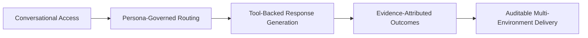

### Stakeholder and Actor Map

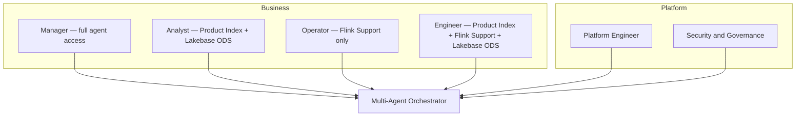

### System Context Diagram

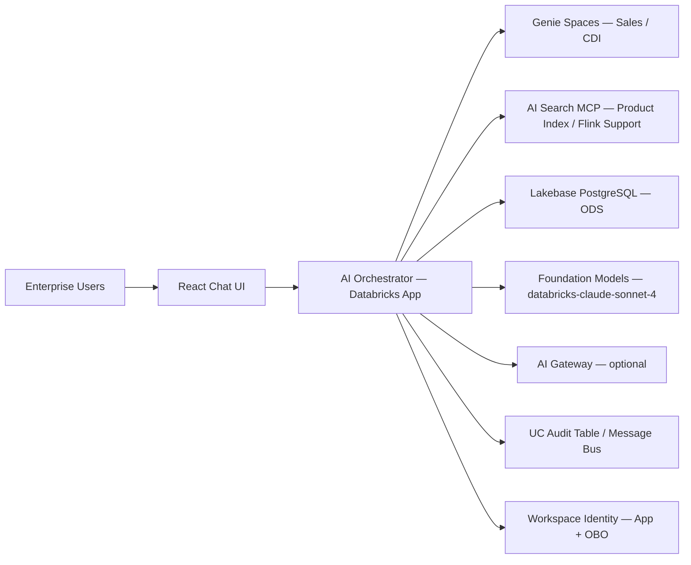

---

## Concept Phase: Detailed

### Persona-Agent Access Matrix

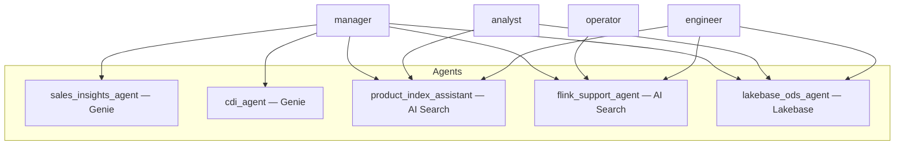

### Trust Boundary and Risk Sketch

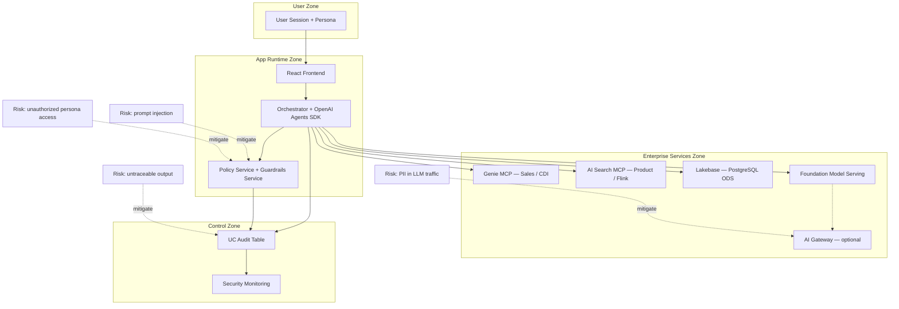

---

## Logical Phase: High Level

### Container Diagram

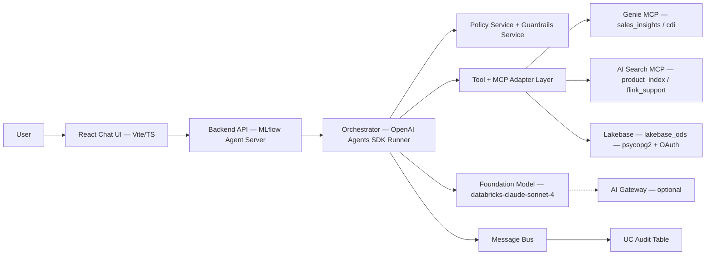

### End-to-End Request Flow

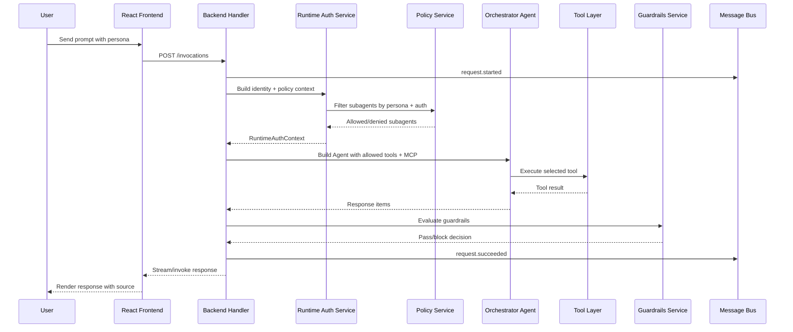

### Security and Identity Flow

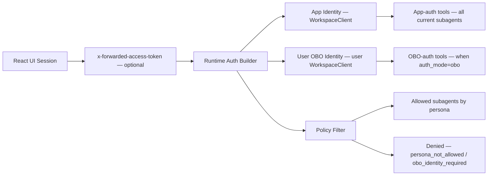

---

## Logical Phase: Detailed

### Component Diagram: Backend Runtime

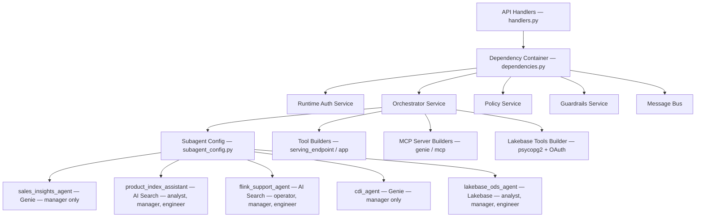

### Policy Rules Decision Tree

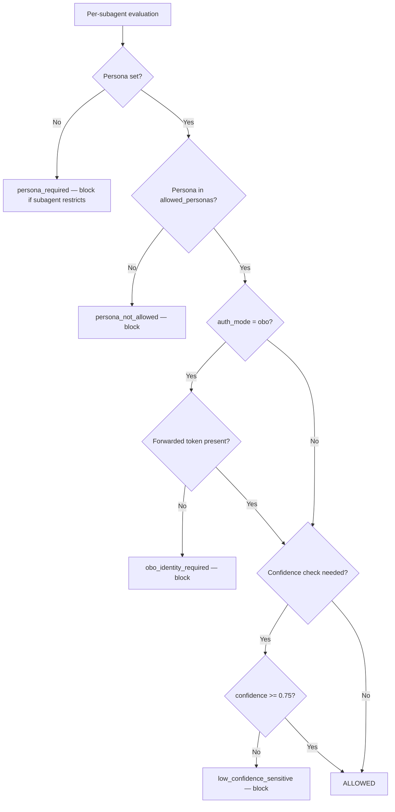

### Failure and Recovery Flow

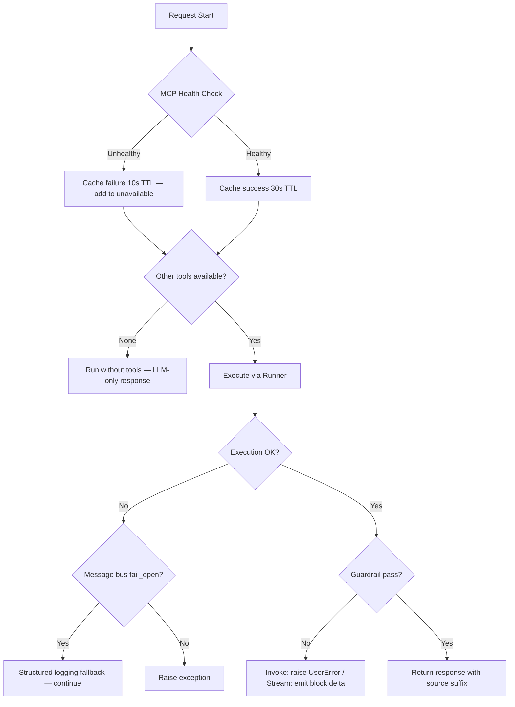

---

## Deployment Phase: High Level

### Environment Topology

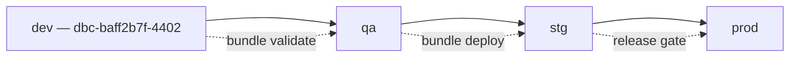

### Runtime Deployment Map

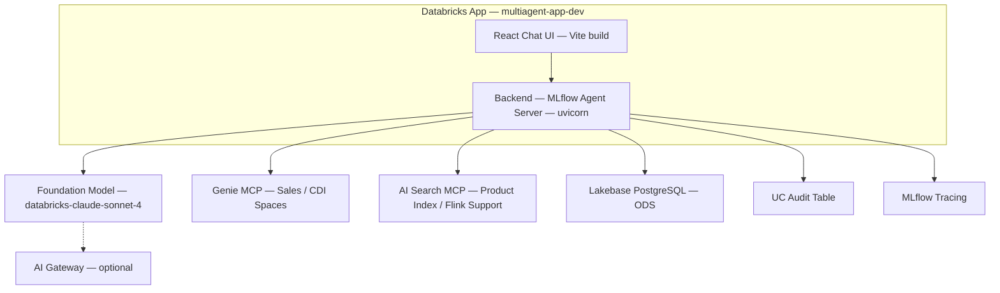

---

## Deployment Phase: Detailed

### CI/CD and Promotion Pipeline

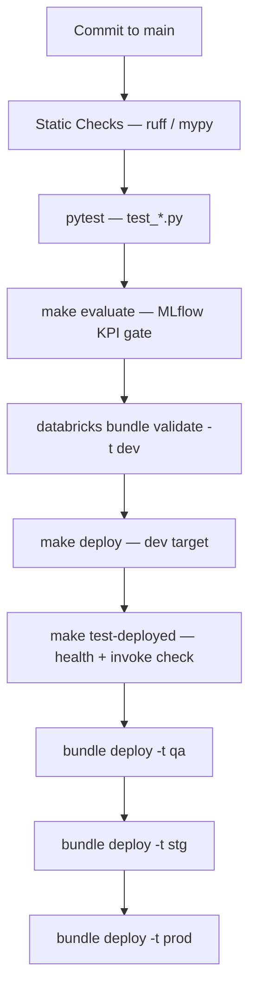

### Observability Architecture

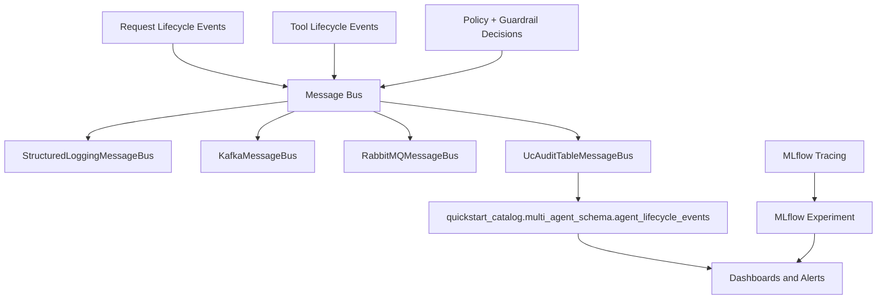
