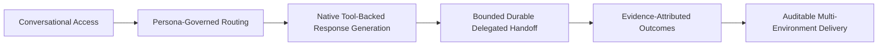
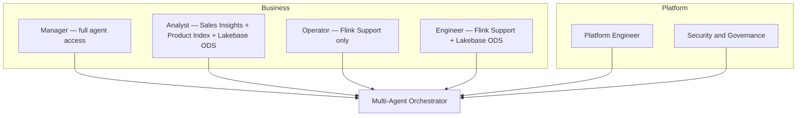
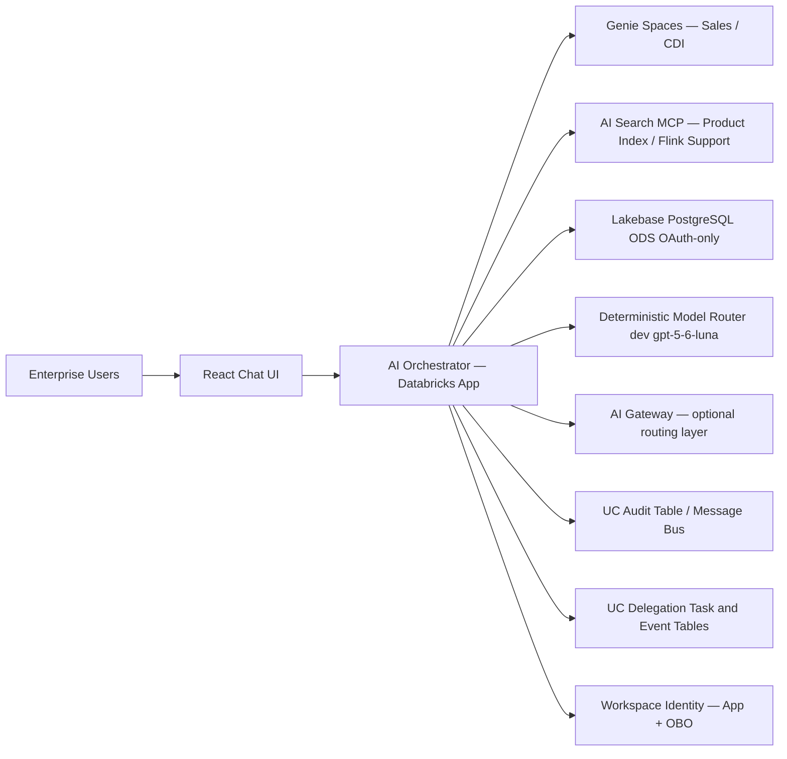
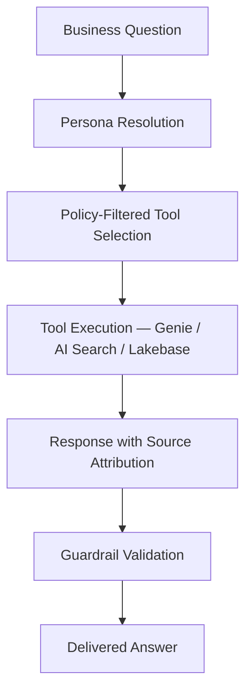

# Concept Business Context

This document captures high-level concept diagrams used to align stakeholders before implementation detail.

## 1. Business Capability Map

## 2. Stakeholder and Actor Map

## 3. System Context Diagram

## 4. Business Value and Decision Flow

## Current Alignment

Concept views describe business intent only. Current implementation uses native function/MCP calls, payload-redacted delegation status, and buffered stream finalization before the UI renders answer deltas. See [runtime technical specifications](../runtime-technical-specs.md) for executable facts.
