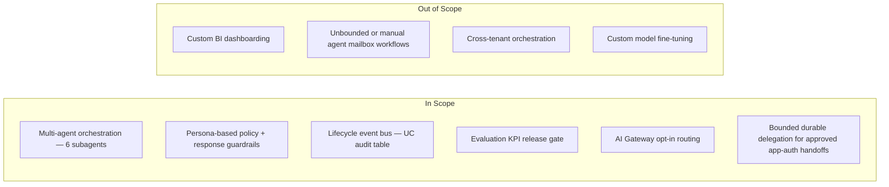
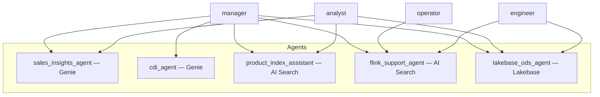
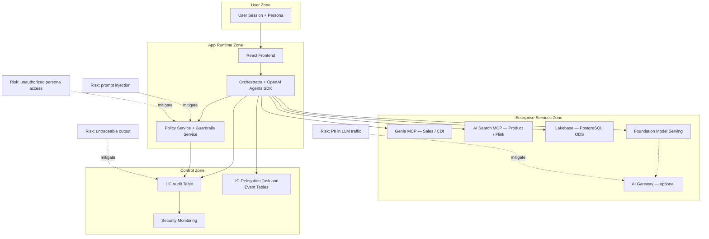

# Concept Scope, Personas, and Boundaries

This document captures detailed concept artifacts that shape implementation boundaries and governance assumptions.

## 1. Product Scope Map

## 2. Persona-Agent Access Matrix

## 3. Trust Boundary and Risk Sketch

## Current Alignment

Delegation is deliberately bounded: app-auth-only approved handoffs persist typed state in Unity Catalog task/event tables, run through a lifespan-managed worker, and expose no task SQL through status responses. It is not a general mailbox or autonomous peer-to-peer chat system.
