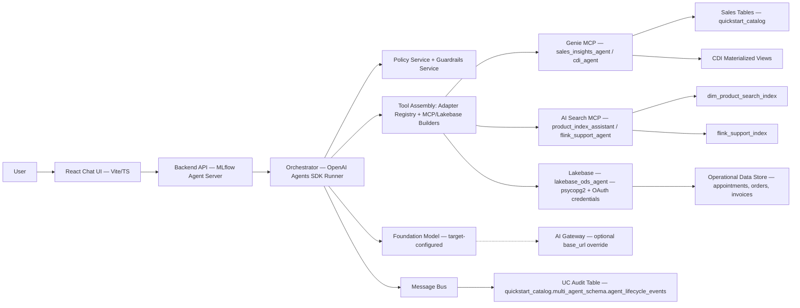
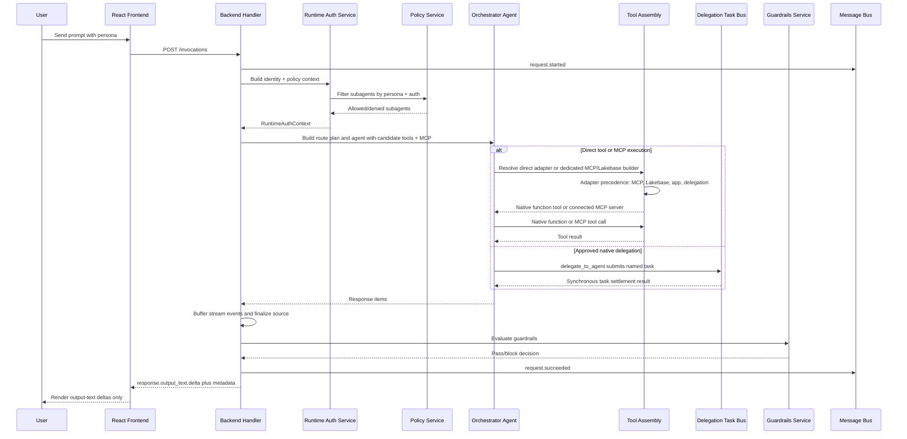
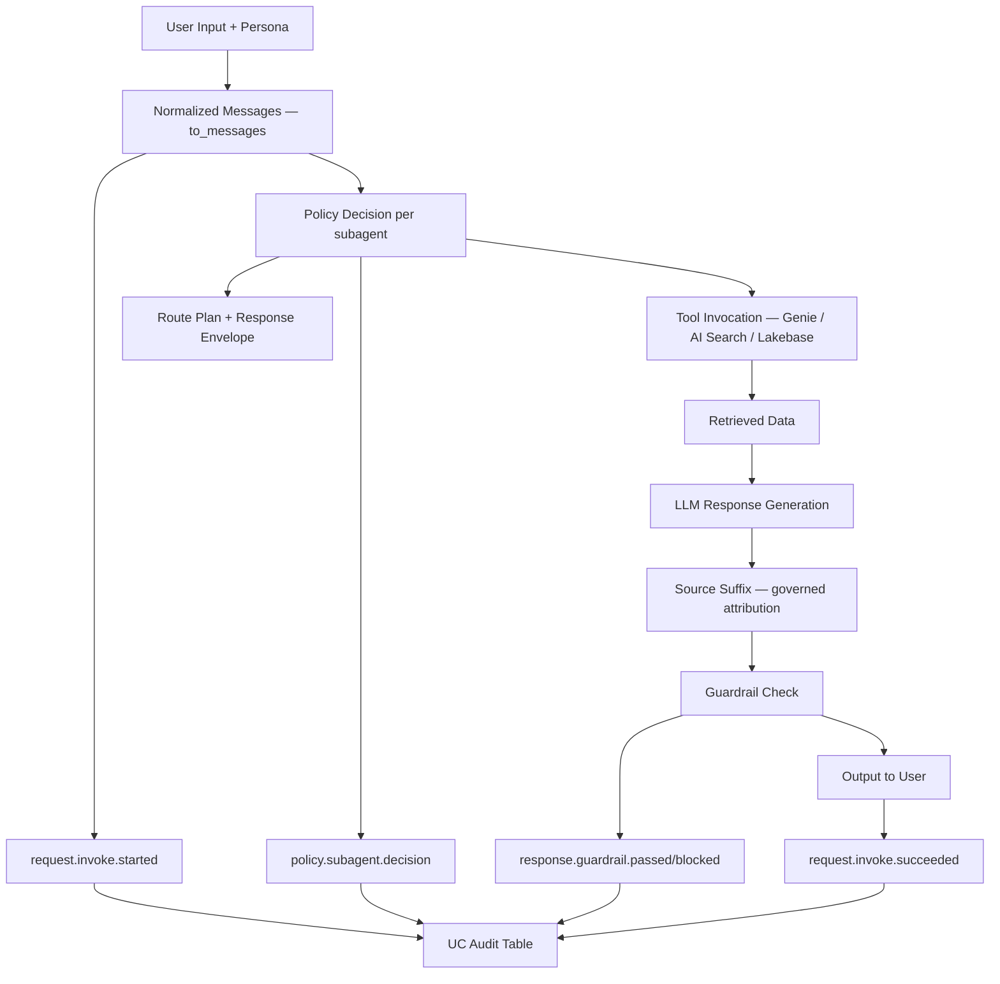
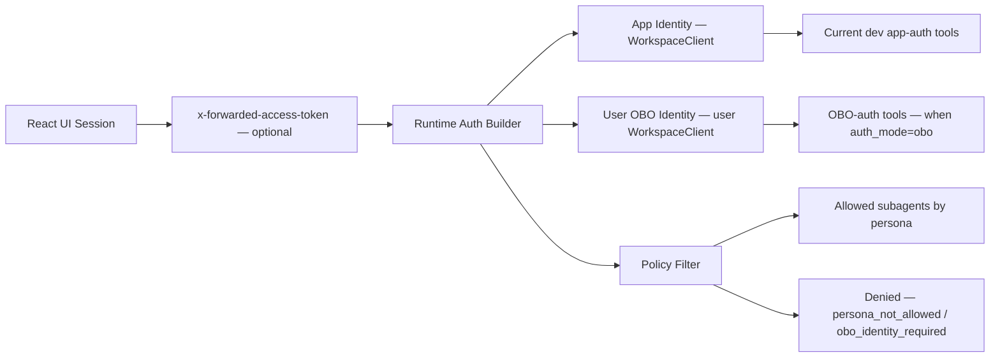

# Logical Containers and Flows

This document captures high-level logical architecture and end-to-end runtime flows.

## 1. Container Diagram

## 2. End-to-End Request Flow

## 3. Data Flow and Lineage

## 4. Security and Identity Flow

## Current Alignment

The logical runtime adds deterministic model routing before agent construction; dev uses `databricks-gpt-5-6-luna` for standard turns and `databricks-claude-sonnet-5` for reasoning/synthesis turns. Streams buffer and finalize before the browser renders `response.output_text.delta` only. See [API contracts](../api-contracts.md) for the client-visible contract.
