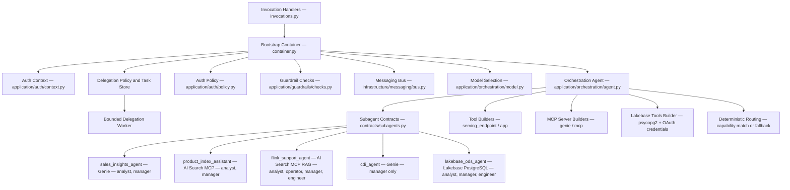
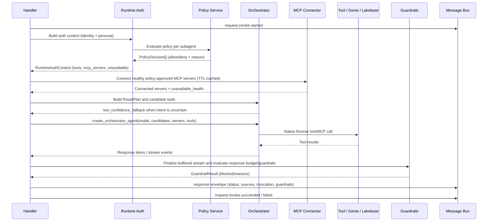
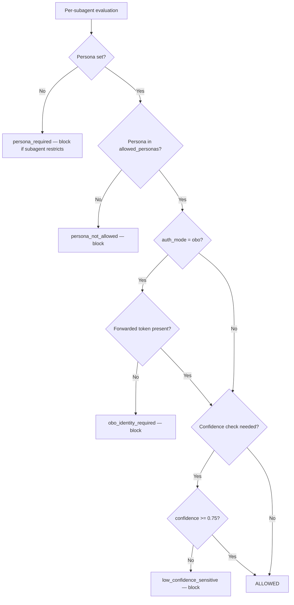
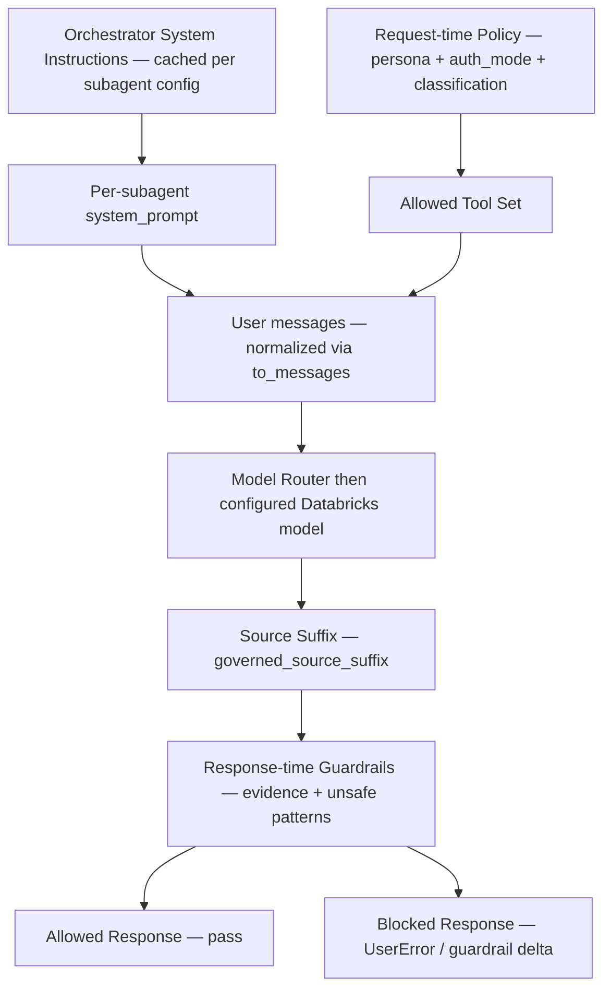
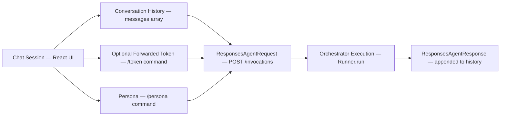
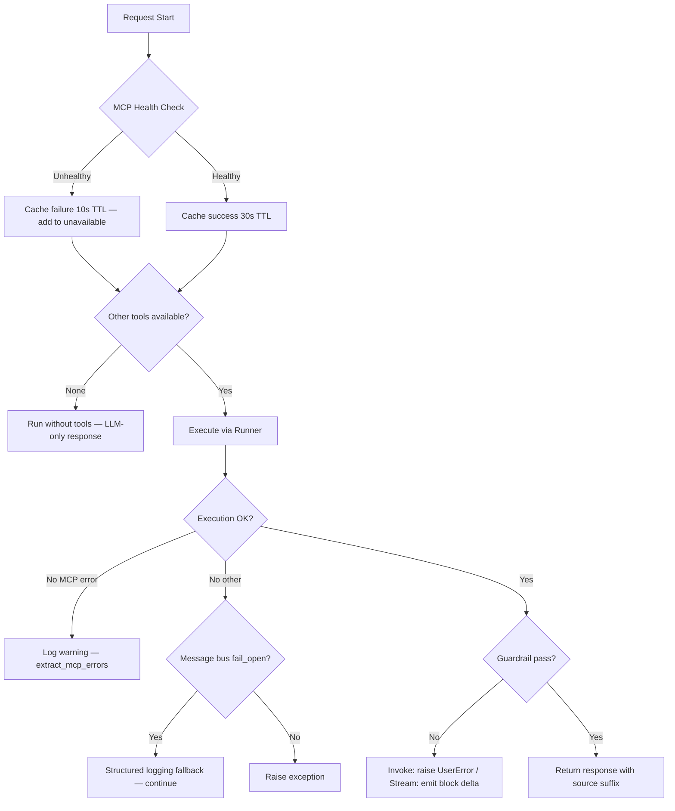
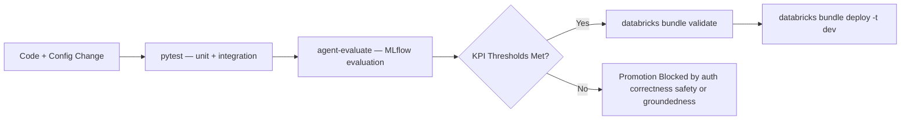

# Logical Phase: Detailed Diagrams

This document captures detailed logical artifacts for engineering implementation and review.

## 1. Component Diagram: Backend Runtime

## 2. Orchestration and Tool Call Sequence

## 3. Policy Rules Decision Tree

## 4. Prompt and Policy Layering

## Current Alignment

Native `delegate_to_agent` handoffs are bounded app-auth tasks. Native handoffs synchronously settle their submitted task; the optional backend lifespan worker leases queued work and status lookup remains redacted. Tool-call accuracy is monitored but non-blocking while nested tool spans cannot be scored reliably.

## 5. Session and State Model

## 6. Failure and Recovery Flow

## 7. Evaluation and Release Gate Flow

