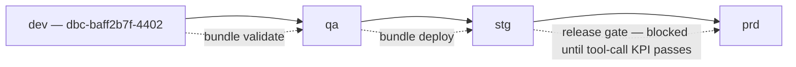
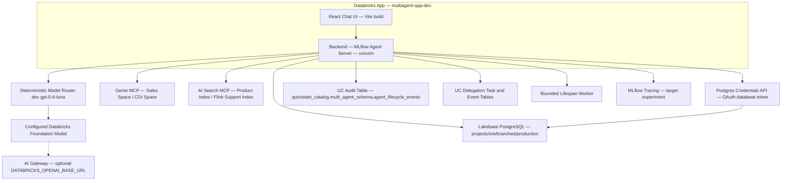
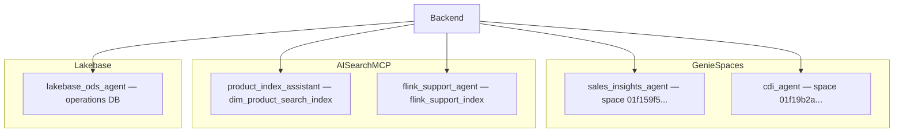

# Deployment Phase: High-Level Diagrams

This document captures high-level deployment architecture across environments.

## 1. Environment Topology

## 2. Runtime Deployment Map

## 3. Subagent Resource Mapping (dev)

## Current Alignment

When Terraform Registry is unavailable, source recovery uses versioned-wheel `make upload-wheel`; it imports and SNAPSHOT-deploys app source but does not apply bundle-managed resources or grants.
