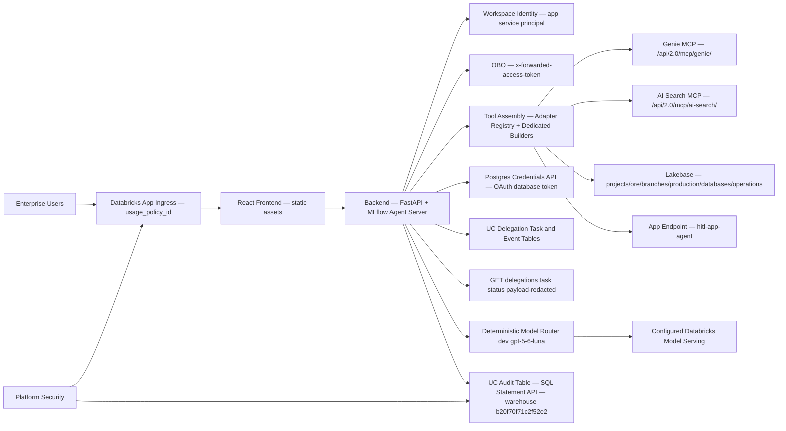
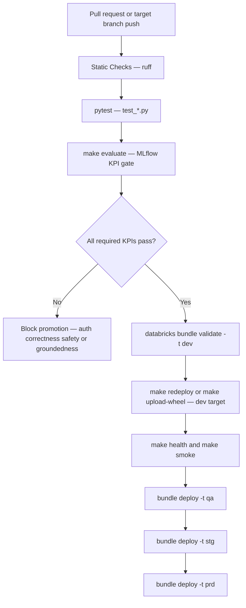
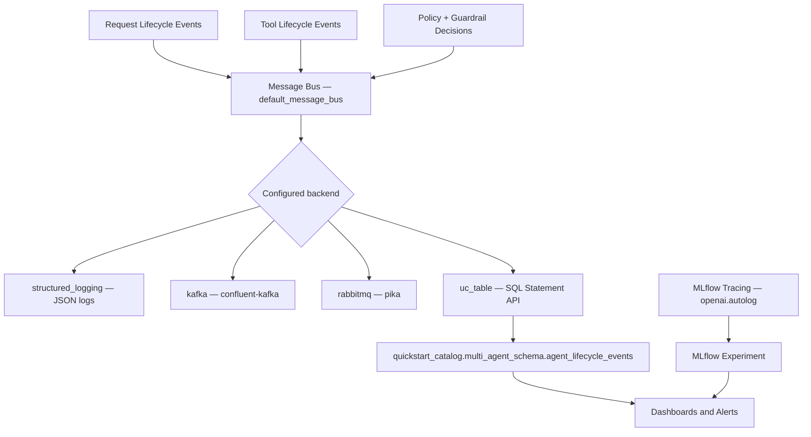
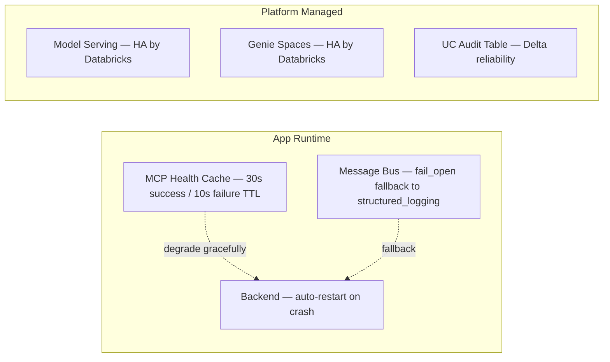

# Deployment Network, CI/CD, and Observability

This document captures detailed deployment and operations diagrams.

## 1. Network and Security Topology

## 2. CI/CD and Promotion Pipeline

## 3. Observability Architecture

## 4. Bundle Variable Configuration (dev target)

```mermaid
flowchart LR
    subgraph BundleVars[databricks.yml + targets/dev.yml]
        V1[app_name = multiagent-app-dev]
        V2[orchestrator_model = target-configured model]
        V3[openai_base_url = empty — direct to model serving]
        V4[message_bus_backend = uc_table]
        V5[genie_space_id = 01f159f5...]
        V6[cdi_genie_space_id = 01f19b2a...]
        V7[lakebase_project_id = ore]
        V8[lakebase_branch_id = production]
        V9[lakebase_database = operations]
        V10[Lakebase postgres resource grant]
        V11[message_bus_async = false — optional fail-open queue]
        V12[agent_task_backend and worker_enabled]
        V13[model_routing_enabled and route models]
        V14[memory_backend and response budgets]
    end

    BundleVars --> App[Databricks App Environment Variables]
    App --> BE[Backend Runtime — get_settings]
```

## 5. HA and Recovery

## Current Alignment

The backend lifespan owns the optional bounded delegation worker. UC delegation state is fail-closed, uses leases and dead-letter states, and requires explicit warehouse/schema/table permissions. Auth correctness, safety, and groundedness block promotion; tool-call accuracy remains monitored but non-blocking while nested tool spans cannot be scored reliably.
