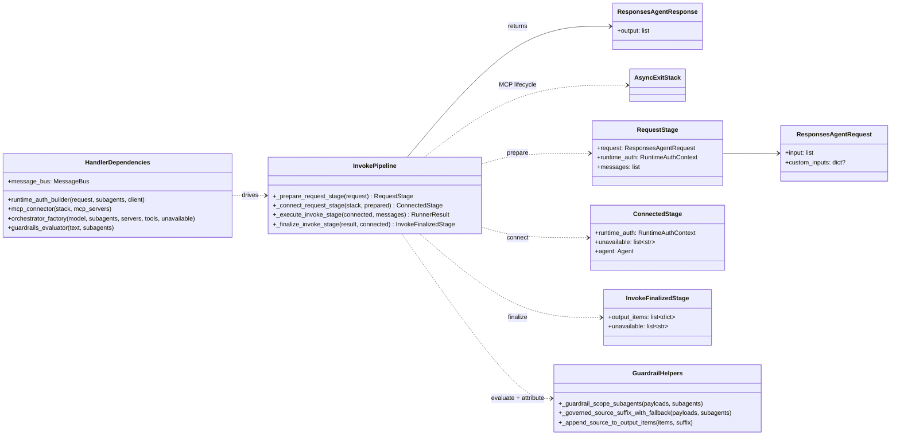
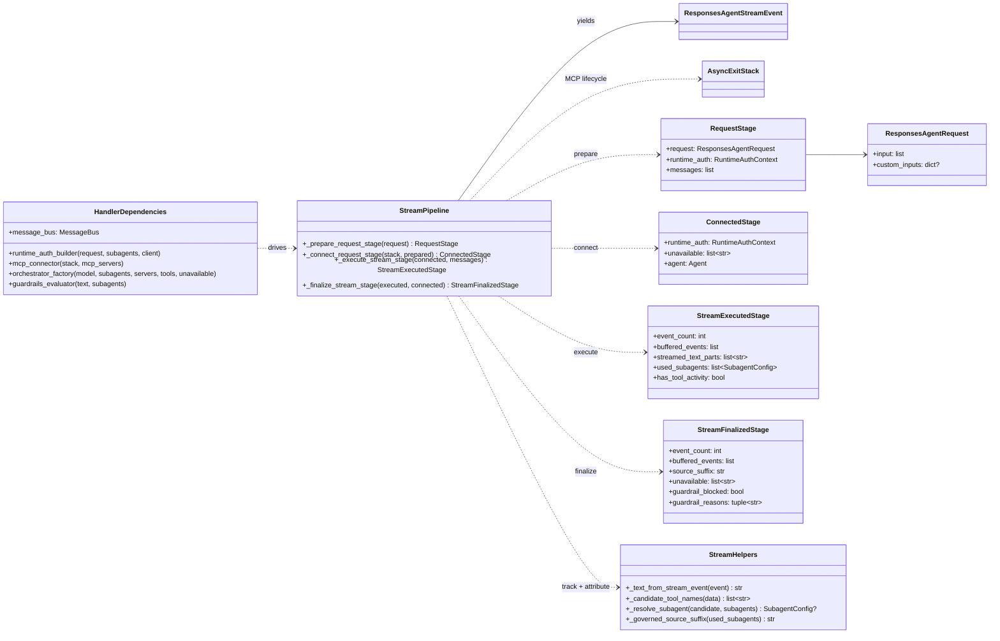

# Request Execution Flow: Class Diagram

These diagrams focus on request execution in `src/backend/api/handlers.py` using the staged-pipeline pattern.
They separate the invoke and stream pipeline views while showing the shared stages.

## Invoke Pipeline

## Stream Pipeline

## Notes

- Shared stages (`_prepare_request_stage`, `_connect_request_stage`) enforce a common pipeline contract for invoke and stream.
- Stream path buffers all events in one pass, tracks `used_subagents` and `has_tool_activity`, then applies guardrails post-execution.
- Guardrail block behavior diverges by mode:
  - invoke: raises `UserError` — caller sees authorization error
  - stream: emits `response.output_text.delta` with block message and terminates
- Source attribution (`_governed_source_suffix`) appends Genie space freshness SLA citations for governed subagents.
