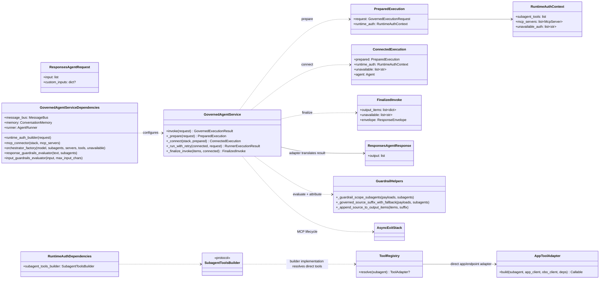
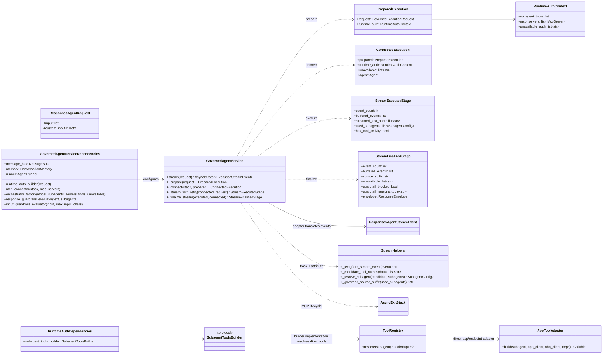

# Runtime Invocation and Stream Pipeline

These diagrams show the delivery-neutral staged pipeline in
`src/aiserver/application/execution/service.py`. The MLflow adapter in
`src/aiserver/api/invocations.py` only translates requests, results, and stream
events.

## Invoke Pipeline

## Stream Pipeline

## Notes

- Shared stages (`_prepare`, `_connect`) enforce a common pipeline contract for invoke and stream.
- Stream path buffers all events in one pass, tracks `used_subagents` and `has_tool_activity`, then applies guardrails post-execution.
- Buffered events become user-visible answer text only after finalization; the UI renders `response.output_text.delta` and keeps other events as metadata.
- Guardrail block behavior diverges by mode:
  - invoke: raises `GovernedExecutionError`, translated to the delivery framework's user error
  - stream: emits `response.output_text.delta` with block message and terminates
- Source attribution (`_governed_source_suffix`) appends Genie space freshness SLA citations for governed subagents.
