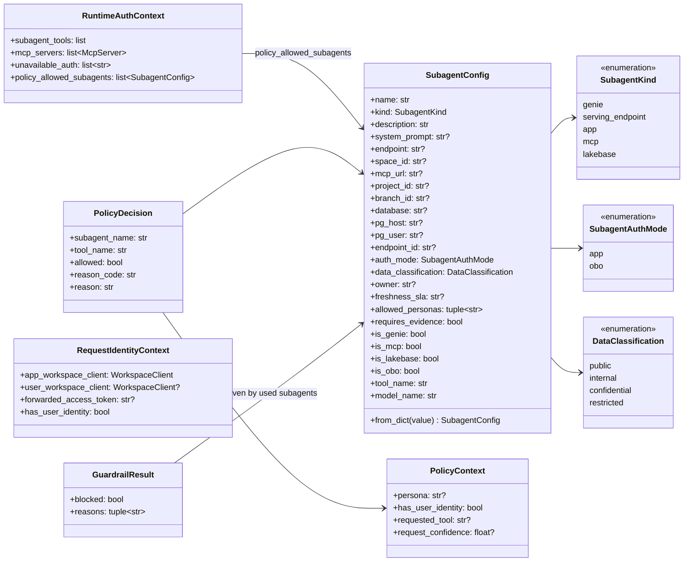
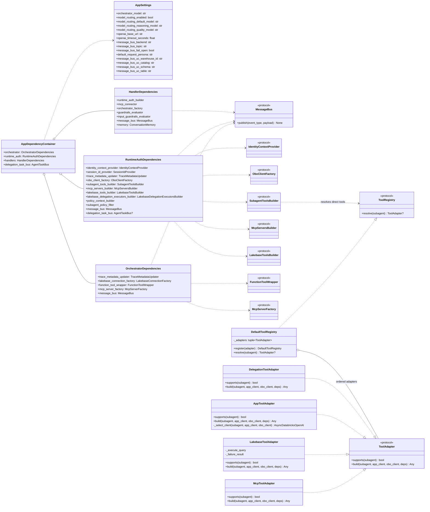
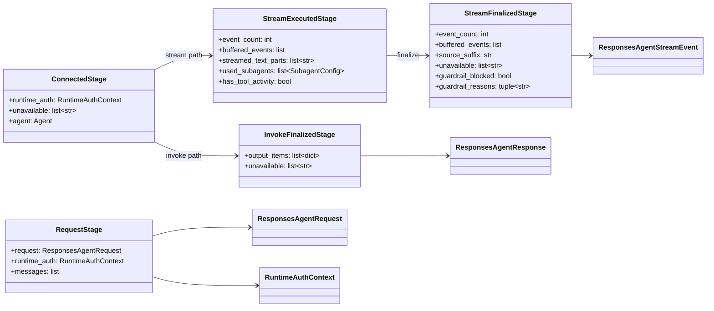
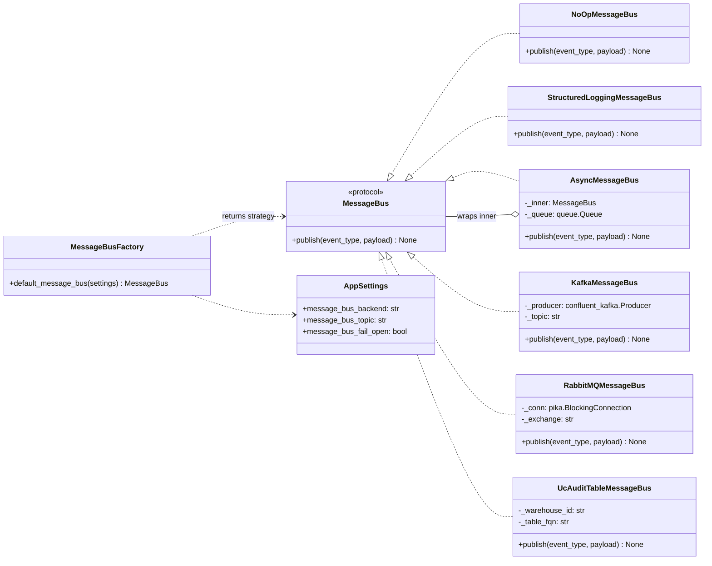
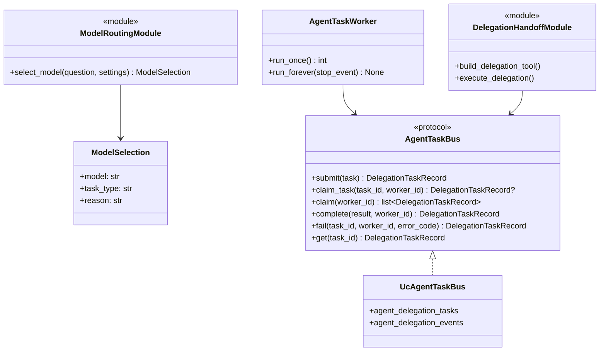
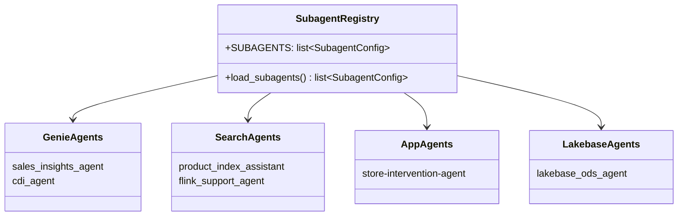

# Backend Class Diagrams

Multi-view UML class diagrams reflecting current implementation naming and relationships.

## 1. Domain and Policy Model

## 2. Dependency Composition and Ports

## 3. Handler Runtime Pipeline Stages

## 4. Message Bus Strategy and Implementations

## 5. Model Routing and Delegation Control Plane

## 6. Subagent Registry

The concrete per-environment registry lives in `src/aiserver/contracts/subagents.<target>.json`. Dev currently defines six logical subagents: two Genie MCP routes, two AI Search MCP routes, one Databricks App HITL specialist, and one Lakebase PostgreSQL route. Environment-specific identifiers such as Genie space IDs, Databricks App endpoints, and Lakebase connection fields are maintained in the target registry files rather than this diagram.

## Notes

- All diagrams mirror current implementation naming in `src/aiserver/`.
- Views are logic-isolated: domain/policy, composition/ports, runtime stages, message bus strategy, subagent registry.
- Use with `07-request-execution-flow-class-diagram.md` for invoke-vs-stream pipeline emphasis.
- The durable delegation and model-routing classes above are the control planes that keep agent expansion bounded, observable, and policy-aware.
