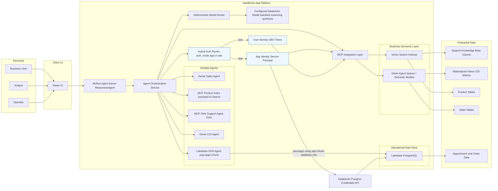
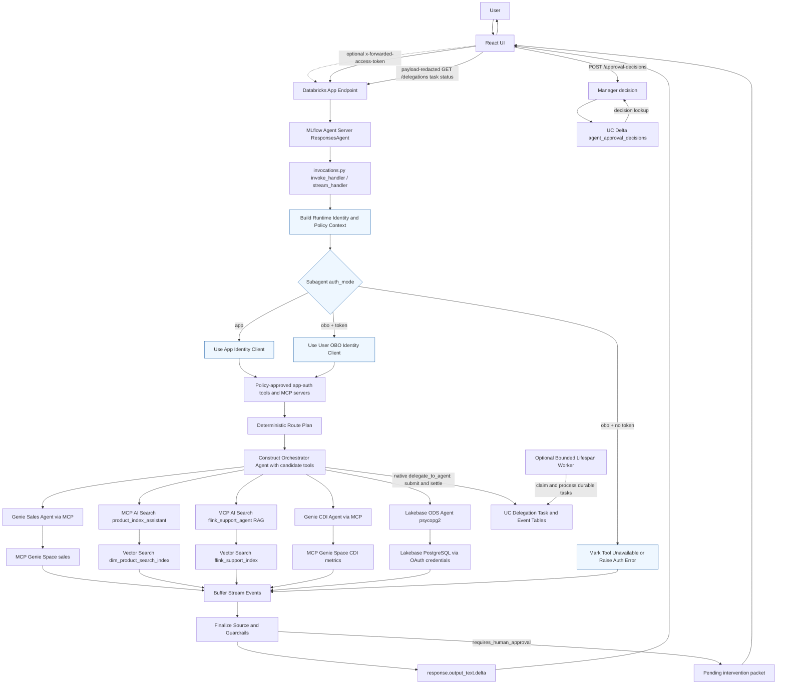

# Multiagent App on Databricks: Architecture (High Level)

## Purpose

Describe the system shape, major boundaries, and end-to-end request flow.

## Scope

This document covers high-level architecture only. See [low-level design](low-level-design.md) for implementation details and the [operations runbook](../operations/operations-runbook.md) for procedures.

## Current Status

- Dev deployment is live with React UI as the primary client.
- Hosted runtime uses `uv run runtime-serve-app`.
- Deployments may intermittently fail when Terraform provider registry is unreachable; versioned-wheel `make upload-wheel` is the source-only operational fallback and does not apply bundle resources or grants.
- Deterministic route-plan unit tests pass. Tool-call accuracy remains monitored but non-blocking while MLflow trace selection cannot score nested tool spans reliably.

## Main Content

### Overview

This project is an MVP multi-agent orchestrator deployed on Databricks Apps.
It routes user requests across backend capabilities:

- Genie Agent tools (via MCP)
- Serving endpoint agents
- Optional app-based specialists
- AI Search MCP routes (RAG)
- Lakebase PostgreSQL databases (SQL via psycopg2 with OAuth credentials)

Authorization boundary:

- App identity is used for app-auth tools.
- User identity (OBO) is used for user-auth tools when a forwarded token is present.
- OBO token propagation uses `x-forwarded-access-token` from UI to backend.
- For non-interactive Databricks Apps invocation tests, use `Authorization: Bearer <token>`.

Runtime stack:

- MLflow Agent Server
- OpenAI Agents SDK
- Databricks OpenAI-compatible runtime clients
- Structured message bus events for request/tool lifecycle observability
- Optional async message-bus publishing mode to reduce request-path event I/O latency
- Governed policy and response-guardrail enforcement for sensitive routes
- Deterministic capability-based route planning with policy-approved fallback
- Typed response envelopes and normalized tool execution metadata for audit and UI inspection
- Human-in-the-loop approval boundary for store intervention recommendations, with durable manager decisions in Unity Catalog

### Major Components

- Client: React UI static app, served in-process by the backend
- Entry runtime: MLflow Agent Server (`ResponsesAgent`)
- Orchestration layer: tool selection and response composition
- Integration layer: MCP + serving endpoint + Lakebase PostgreSQL calls
- Data and semantic layer: Genie Agent space, enterprise data assets
- Approval and audit layer: pending decision envelopes, manager decision API, and UC Delta approval records

### Frameworks and Platform Stack

- FastAPI: backend API framework for agent runtime endpoints.
- Uvicorn: ASGI server for backend execution.
- MLflow Agent Server (`ResponsesAgent`): invoke/stream serving runtime.
- OpenAI Agents SDK: agent orchestration and tool-calling loop.
- Databricks OpenAI integration: Responses API client integration for Databricks-hosted models and endpoints.
- React UI (TypeScript): conversational frontend and streaming interaction layer.
- Databricks Apps: managed application hosting platform.
- Databricks Declarative Automation Bundles (DAB): deployment framework with target-based environment management.

### Deployment Diagram



### Request Flow



### Authorization Routing

### Human Approval Boundary

The `store-intervention-agent` can analyze revenue and CDI signals and prepare an evidence-backed packet, but it cannot authorize operational dispatch. The response is marked pending when manager approval is required. A manager decision is submitted through `/approval-decisions` and persisted in the UC approval table; any future dispatcher must validate that record independently before acting. See [Human-in-the-loop approval](../governance/human-in-the-loop.md).

The orchestrator uses subagent-level auth configuration (`auth_mode`) to decide execution identity:

- `app`: run tool/MCP calls with app identity.
- `obo`: run tool/MCP calls with user identity derived from forwarded token.

If an `obo` tool is required but no forwarded token is available, the tool is marked unavailable or returns a clear authorization error.

### Model and Delegation Control Plan

The deterministic model router classifies requests as standard, reasoning, or synthesis before agent assembly. Dev currently resolves every class to `databricks-gpt-5-6-luna`; routing metadata is not proof of tool-call correctness.

Approved app-auth handoffs use `delegate_to_agent` and persist bounded work in Unity Catalog task/event tables. Native handoffs synchronously settle their submitted task; the optional lifespan-managed worker separately processes durable queued work. `GET /delegations/{task_id}` returns payload-redacted status.

### Lakebase OAuth Configuration

The dev app uses the existing Lakebase Autoscaling resources:

- Project: `ore`
- Branch: `production`
- Runtime database: `operations`
- Database resource ID: `db-j7lf-e5xmy0cwq4`
- Endpoint: `primary`

Runtime code requests a short-lived database OAuth credential from the Databricks Postgres credentials API. The configured `pg_user` must match the app service principal's Lakebase OAuth role.

The app resource grant uses the Autoscaling form:

```yaml
postgres:
    branch: projects/ore/branches/production
    database: projects/ore/branches/production/databases/db-j7lf-e5xmy0cwq4
    permission: CAN_CONNECT_AND_CREATE
```

Conversation/persona memory (`MEMORY_BACKEND=lakebase`) uses the same project/branch/endpoint but a separate `agent_memory` database, isolated from the `operations` database used by `lakebase_ods_agent`. See [Tool and Model Registry](tool-and-model-registry.md#conversation-memory-lakebase-not-a-subagent).

### Execution and Frontend Metadata

Before orchestration, the handler applies input guardrails and builds a capability-based route plan. Tool and MCP execution emits lifecycle metadata including status, latency, attempt count, auth mode, and error code. Stream events are finalized after guardrail evaluation; the React UI renders only text deltas and displays tools, source categories, guardrail state, auth state, persona, and response-budget status in a collapsible run-context panel.

### Message Bus Observability

The runtime publishes message-bus events at key orchestration points:

- Request lifecycle: invoke/stream started, succeeded, failed
- Runtime auth lifecycle: identity resolved, trace metadata updated, context built
- Policy lifecycle: subagent allow/deny decision events with reason codes
- Tool lifecycle: tool call started, succeeded, failed
- MCP lifecycle: server registered or unavailable
- Response lifecycle: guardrail pass/block decisions

Supported message bus backends:

- `structured_logging` (default)
- `noop`
- `kafka`
- `rabbitmq`
- `uc_table` for Unity Catalog-governed Delta audit persistence

Optional runtime mode:

- `MESSAGE_BUS_ASYNC=true` to enqueue lifecycle events for background publishing

Async publishing requires `MESSAGE_BUS_FAIL_OPEN=true`; the configured backend is selected per deployment rather than receiving a fan-out copy of every event.

### Environment Topology

| Environment | Target | Mode | Profile |
| ---- | ---- | ---- | ---- |
| Development | dev | development | dev |
| QA | qa | development | qa |
| Staging | stg | production | stg |
| Production | prd | production | prd |

## Related Docs

- [Architecture guide](README.md): authority map and role-based reading paths
- [Business specifications](../product/business-specs.md): business goals and requirements
- [Runtime technical specifications](runtime-technical-specs.md): centralized technical domain map
- [Low-level design](low-level-design.md): implementation details
- [Design artifacts](design-artifacts/README.md): concept, logical, deployment, and runtime diagrams
- [Request execution pipeline](design-artifacts/07-request-execution-flow-class-diagram.md): invoke/stream staged execution
- [Operations runbook](../operations/operations-runbook.md): deployment and incident handling
