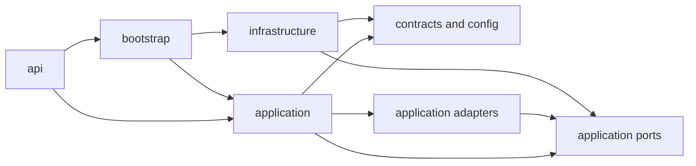

# Layered Agentic Architecture

## Purpose

The backend separates request delivery, agent use cases, business concepts,
external-system adapters, and dependency composition. This keeps orchestration
logic independent of concrete Databricks, MLflow, persistence, and messaging
implementations.

## Package Structure

```text
src/aiserver/
├── api/                       # HTTP and AgentServer delivery handlers
├── application/               # Agent use cases and application ports
│   ├── adapters/               # Concrete tool adapter registry and strategies
│   ├── auth/                  # Runtime identity and policy evaluation
│   ├── delegation/            # Agent handoff and durable task processing
│   ├── guardrails/            # Input and response governance controls
│   ├── orchestration/         # Routing, tool assembly, and model selection
│   └── ports/                 # Interfaces owned by application code
├── bootstrap/                 # Composition root for concrete dependencies
├── config/                    # Dependency-neutral environment settings
├── contracts/                 # Typed cross-layer contracts and target registries
├── infrastructure/            # Concrete external-system adapters
│   ├── databricks/            # Lakebase OAuth and PostgreSQL connectivity
│   ├── messaging/             # Lifecycle event publishers
│   ├── observability/         # MLflow trace integration
│   └── persistence/           # Lakebase memory and UC task persistence
```

## Dependency Direction



`application` must not import `api`, `bootstrap`, or `infrastructure`.
Application use cases depend on ports such as `MessageBus`, `ConversationMemory`,
`TraceMetadataUpdater`, `ToolAdapter`, and `ToolRegistry`. The concrete tool
adapter registry is application code: it resolves direct function-tool strategies
without coupling orchestration to a particular subagent kind. The composition root in
`aiserver.bootstrap.container` constructs concrete MLflow, messaging, and
persistence implementations and injects them into those use cases.

`contracts` and `config` are foundational and must not import higher layers.
`infrastructure` can implement application ports but must not import `api` or
`bootstrap`.

## Architectural Verification

`tests/test_layer_isolation.py` statically checks these import boundaries. Run
the full validation suite with:

```bash
.venv/bin/python -m pytest -q
.venv/bin/ruff check src tests
```