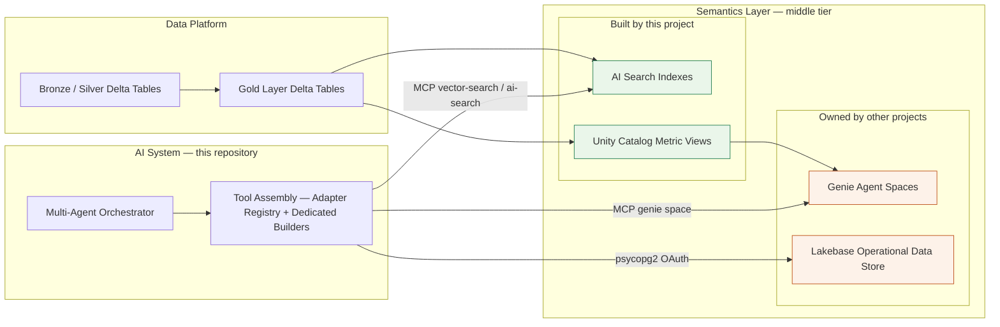

# Semantics Layer Design and Implementation

## Purpose

Define the design and implementation boundary of the semantics layer: the governed middle tier between the enterprise data platform (Delta Lake) and the AI systems in this repository (orchestrator, Genie Agents, MCP tools). This document distinguishes what this project builds and owns from what other projects own and this project only consumes at runtime.

## What the Semantics Layer Is

The semantics layer turns raw and gold-layer Delta Lake tables into AI-ready, governed retrieval and query surfaces:

- **AI Search indexes** — vector/semantic search over Delta Lake source tables, built and refreshed by pipelines.
- **Unity Catalog Metric Views** — governed, reusable business metric definitions over gold-layer Delta tables, queried by Genie Agents.
- **Genie Agent spaces** — natural-language query surfaces bound to Metric Views or governed tables.
- **Operational data store (ODS) access** — a service point into Lakebase Postgres for real-time operational data (appointments, orders, scheduling) that does not live in Delta Lake.

## Scope Boundary

This project implements **only part** of the full ai-ready semantics layer. The rest is owned and operated by other projects, and this app only integrates with it at runtime.

| Component | Built/owned by this project | Notes |
| --- | --- | --- |
| AI Search (Vector Search) indexes | **Yes** | Built by pipelines in `src/semantics/`, deployed as Databricks Jobs in `resources/semantics_jobs.yml`. |
| Unity Catalog Metric Views | **Yes** | Published by `src/semantics/create_fct_cdi_trusted_expert_score_metric_view.py` over gold-layer Delta tables. |
| Genie Agent spaces | No — other project | This repo only registers the Genie space id in `src/aiserver/contracts/subagents.<target>.json` and routes to it via MCP. Space creation, metric-view binding at the Genie level, and prompt tuning are owned by the Genie/analytics project. |
| Lakebase operational data store | No — other project | The Lakebase project (Postgres instance, schema, ODS tables, real-time ingestion) is provisioned and owned by a separate project. This repo only holds a service point (`lakebase_ods_agent` subagent) that connects via OAuth-authenticated `psycopg2` for read queries. |

Consequence: this repository's semantics-layer responsibility is limited to **AI Search indexes** and **Metric Views** built from Delta Lake gold-layer tables. Genie Agent space configuration and Lakebase provisioning are external dependencies, tracked here only as integration points.

## Design

### 1. AI Search Indexes (built by this project)

- Source: Delta Lake tables curated from gold-layer or staging data (`dim_product`, `flink_support_kb`).
- Pipeline: a Databricks notebook per index ensures/curates the source Delta table, then creates or refreshes a Vector Search `DELTA_SYNC` index with Databricks-managed embeddings.
- Consumption: the orchestrator queries the index through the managed MCP route (`/api/2.0/mcp/vector-search/...` or `/api/2.0/mcp/ai-search/...`), not through this repo's own retrieval code.
- Current indexes:
  - `quickstart_catalog.multi_agent_schema.dim_product_search_index` — product catalog search (`product_index_assistant` MCP tool).
  - `quickstart_catalog.multi_agent_schema.flink_support_index` — support knowledge base RAG (`flink_support_agent` MCP tool).

### 2. Unity Catalog Metric Views (built by this project)

- Source: gold-layer Delta assets (for example `dt_prod_gold.dwh_dbx.fct_cdi`) joined to supporting daily/aggregate assets.
- Pipeline: a Databricks notebook publishes/refreshes a `CREATE VIEW ... WITH METRICS LANGUAGE YAML` object defining dimensions, measures, and value formatting.
- Consumption: a Genie Agent space (owned by another project) is bound to the Metric View as its structured semantic source; this repo only stores the resulting `space_id` in subagent config and routes requests to it via MCP.
- Current metric view: `quickstart_catalog.multi_agent_schema.fct_cdi_trusted_expert_score_metric_view`.

### 3. Genie Agent Spaces (external dependency)

- Created and maintained by the Genie/analytics project, using the Metric Views this project publishes (or other governed sources) as their structured semantic source.
- This project's only touchpoints: `space_id` registration in `src/aiserver/contracts/subagents.<target>.json`, `CAN_RUN` permission grants in `resources/multiagent_app.yml`/`targets/*.yml`, and MCP-based query routing in the orchestration agent.
- Current Genie Agents, all created and owned by the Genie/analytics project: `sales_insights_agent` and `cdi_agent`. Neither space, nor its underlying semantic model, is created by this repository.
- Recommended blueprint for the owning project: [Unity-Catalog-Semantic-Metric-Views-Blueprint](https://github.com/wchen-dea/Unity-Catalog-Semantic-Metric-Views-Blueprint).

### 4. Lakebase Operational Data Store (external dependency)

- The Lakebase project (Postgres instance, database, real-time operational tables such as appointments/orders) is provisioned and operated independently of this repository.
- This project's only touchpoint is a service point: the `lakebase_ods_agent` subagent (`kind: lakebase`) in `src/aiserver/contracts/subagents.<target>.json`, which executes read SQL against the ODS database using short-lived OAuth credentials obtained through the Databricks Postgres credentials API (`src/aiserver/infrastructure/databricks/lakebase.py`).
- This repo does not create the Lakebase project, schema, or ingestion pipelines, and does not own its data model.

## Implementation

| Layer | Location |
| --- | --- |
| Build pipelines (notebooks) | [src/semantics/](../../src/semantics) — see [src/semantics/README.md](../../src/semantics/README.md) |
| Build automation (jobs) | `resources/semantics_jobs.yml` (one Databricks Job per notebook) |
| Runtime consumption config | `src/aiserver/contracts/subagents.<target>.json` (MCP URLs, Genie space ids, Lakebase connection fields) |
| Runtime consumption code | `src/aiserver/application/orchestration/agent.py` (MCP/Genie routing), `src/aiserver/infrastructure/databricks/lakebase.py` (Lakebase OAuth/psycopg2) |
| Registry/inventory | [Tool and model registry](tool-and-model-registry.md) |

## Related Docs

- [Tool and model registry](tool-and-model-registry.md): active index/Genie/Lakebase inventory and ownership metadata.
- [High-level architecture](high-level-architecture.md): system-level view of the Business Semantic Layer and Operational Data Store.
- [Low-level design](runtime-behavior-and-implementation.md): bundle layout, including `resources/semantics_jobs.yml`.
- [Governance: business semantics metadata](../governance/business-semantics-metadata.md): canonical business semantics and AI metadata contract.
- [src/semantics/README.md](../../src/semantics/README.md): notebook-level build automation details.
