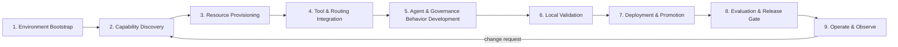

# Claude Code Skills Across the AI System Development Life Cycle

## Purpose

Map the project's Claude Code skills (`.claude/skills/`) to the stages of this repository's AI system development life cycle, and document the best practices for using each skill at its stage. This complements [../development/ai-agent-guidelines.md](../development/ai-agent-guidelines.md) (skill mechanics and invocation) with a life-cycle view for onboarding and process consistency.

## Scope

Covers the 12 active skills: `environment-quickstart`, `capability-discover`, `capability-create`, `capability-register`, `behavior-modify`, `governance-routing`, `governance-guardrails`, `governance-auth-obo`, `observability-audit`, `environment-run-local`, `quality-evaluation`, `release-deploy`. Production monitoring remains governed by [operations/monitoring-and-observability.md](../operations/monitoring-and-observability.md).

## Life Cycle Stages and Skill Mapping

| Stage | Skill(s) | When Used | Key Outputs |
| --- | --- | --- | --- |
| 1. Environment bootstrap | `environment-quickstart` | First-time setup, missing `.env`/auth profile/MLflow experiment | Working `.env`, Databricks auth profile, MLflow experiment id |
| 2. Capability discovery | `capability-discover` | Before adding or changing any tool/subagent | Genie `space_id`, serving endpoint names, UC resource identifiers |
| 3. Resource provisioning | `capability-create` | Required Genie space, endpoint, or app resource does not exist yet | New Genie Agent, serving endpoint, or Databricks app resource |
| 4. Tool & routing integration | `capability-register` | Wiring a discovered/created resource into the app | Updated `src/aiserver/contracts/subagents.<target>.json`, updated `resources/multiagent_app.yml` permissions |
| 5. Agent & governance behavior development | `behavior-modify`, `governance-routing`, `governance-guardrails`, `governance-auth-obo`, `observability-audit` | Changing orchestration logic, route selection, guardrail policy, auth-mode enforcement, or lifecycle/audit event behavior | Updated backend orchestration, routing rules, guardrail checks, auth validation, or message-bus/event schema code |
| 6. Local validation | `environment-run-local` | After any code change, before release-deploy | Healthy local app, passing `/invocations` smoke test, `runtime-preflight` checks |
| 7. Evaluation & release gate | `quality-evaluation` | Before promoting past `dev`/`qa` | KPI evidence against release-gate thresholds |
| 8. Deployment & promotion | `release-deploy` | Shipping evaluation-approved changes to `dev`/`qa`/`stg`/`prd` | Deployed Databricks app, bundle-applied resource grants, post-deploy health check |
| 9. Operate & observe | *(no dedicated skill — see [operations/monitoring-and-observability.md](../operations/monitoring-and-observability.md))* | Continuously in deployed environments | Lifecycle/audit events, MLflow traces, incident detection |

## Best Practices by Stage

### 1. Environment bootstrap (`environment-quickstart`)
- Run once per developer machine or when `.env`/auth breaks; do not re-run just to "be safe" before every task.
- Verify with `databricks auth profiles`, `uv run runtime-preflight`, and `uv run runtime-serve-app` before moving to discovery.

### 2. Capability discovery (`capability-discover`)
- Always run discovery before `capability-register` or `capability-create` so IDs/endpoint names come from the actual target workspace, not assumptions.
- Store discovered identifiers in `targets/*.yml` variables, never hardcode them in application code.

### 3. Resource provisioning (`capability-create`)
- Only invoke when discovery confirms the resource is genuinely missing; do not provision duplicate Genie spaces or endpoints.
- Record ownership, risk classification, and freshness expectations for any new resource in [architecture/tool-and-model-registry.md](../architecture/tool-and-model-registry.md).

### 4. Tool & routing integration (`capability-register`)
- Never change routing (`subagents.<target>.json`) without a matching permission update in `resources/multiagent_app.yml` — routing and permission changes must land together.
- Match subagent type to its required fields (`genie` → `space_id`, `serving_endpoint`/`app` → `endpoint`, `mcp` → `mcp_url`, `lakebase` → `project_id`/`branch_id`/`endpoint_id`/`database`/`pg_host`).

### 5. Agent & governance behavior development
- Use `behavior-modify` for orchestration/request-handling changes; use the `governance-*` and `observability-audit` skills for policy-scoped changes so each change stays scoped to its owning module and playbook.
- Keep direct function-tool changes in `application/adapters/tools.py`; MCP and Lakebase use dedicated builders in `application/orchestration/agent.py`; delegation uses the task-bus handoff flow. Do not blur these boundaries.
- Validate with `python -m py_compile src/aiserver/*.py src/operations/*.py` and `uv run runtime-preflight` before moving to local validation.

### 6. Local validation (`environment-run-local`)
- Run after every behavior change, not only before deployment — catching regressions locally is cheaper than catching them at `release-deploy`.
- Exercise both `uv run runtime-serve-app` (bundled) and `uv run runtime-serve-backend --reload` (iterative) paths, and hit `http://localhost:8000/invocations` as a smoke test.

### 8. Deployment & promotion (`release-deploy`)
- Use the explicit DAB and Databricks Apps deployment sequence in the operations runbook so validation, deployment, permissions, and verification remain visible.
- Prefer binding an existing app over deleting it on name conflicts; use `make build-app-source` when Terraform Registry is unavailable, and still apply the bundle for resource-grant changes.
- Always pass `--profile` explicitly; never rely on an implicit default profile across targets.

### 7. Evaluation & release gate (`quality-evaluation`)
- Do not promote past `dev`/`qa` without KPI evidence meeting the thresholds in [quality/evaluation-specification.md](../quality/evaluation-specification.md); this is a gate, not a formality.

### 9. Operate & observe
- Confirm lifecycle/audit events are flowing (message bus backend healthy) after every deployment, per [operations/monitoring-and-observability.md](../operations/monitoring-and-observability.md).
- Feed production incidents or drift back into stage 2 (discovery) rather than patching runtime behavior directly in production.

## Cross-Cutting Practice

- Explicitly name the skill(s) in your prompt (see the prompt template in [../development/ai-agent-guidelines.md](../development/ai-agent-guidelines.md)) so execution stays aligned with the stage's expected inputs/outputs.
- Do not skip stages backward-to-forward (e.g., `release-deploy` before `environment-run-local`) except for explicitly read-only or rollback operations.
- Every skill invocation that changes routing, permissions, guardrails, or auth must be traceable to an updated file listed in its "Key Outputs" column above — an agent behavior change with no corresponding file diff should be treated as incomplete.

## Related Docs

- [../development/ai-agent-guidelines.md](../development/ai-agent-guidelines.md): skill matrix, invocation mechanics, and per-skill commands.
- [architecture/technology-and-patterns.md](../architecture/technology-and-patterns.md): skills inventory alongside frameworks, patterns, and tools.
- [quality/evaluation-specification.md](../quality/evaluation-specification.md): release-gate KPIs and evidence requirements.
- [operations/monitoring-and-observability.md](../operations/monitoring-and-observability.md): production observability posture.
