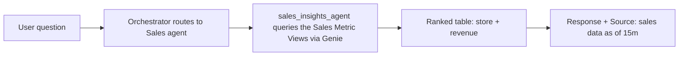
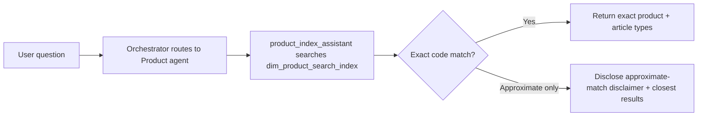
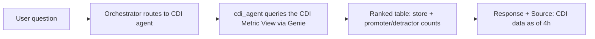
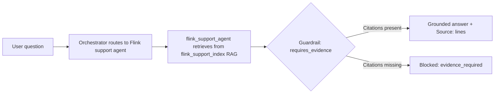
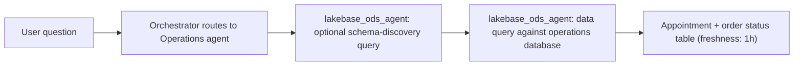
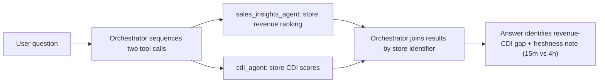
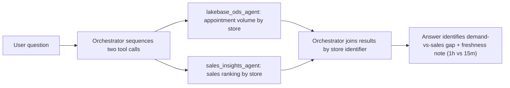

# Agent Usage Guide

A user-facing guide to what each assistant agent is best at, so you can ask questions that get a fast, accurate, well-grounded answer on the first try. You never have to pick an agent yourself — the orchestrator routes automatically — but knowing each agent's strength helps you phrase questions that match its data.

## Homepage Starter Tabs

The chat homepage groups sample questions into four tabs (`src/aiweb/src/App.tsx`):

- **Business** — single-agent questions over Sales, Product, or CDI data.
- **Operations** — single-agent questions over live appointment/order data or Flink troubleshooting.
- **Insight** — composite questions that combine two agents' data into one synthesized answer (see [Questions That Combine Multiple Agents](#questions-that-combine-multiple-agents)).
- **Commands** — `/persona` switches for testing persona-restricted routing.

## Quick Reference: Perfect-Match Query Types

| Agent | Backing data | Data freshness | Ask this agent about | Don't ask this agent about |
| --- | --- | --- | --- | --- |
| **Sales agent** (`sales_insights_agent`) | Sales semantic layer (Unity Catalog Metric Views) | Updated every 15 minutes | Revenue, margin, and units sold by store, product, region, or season; top/bottom-N store or product rankings; period-over-period trend comparisons | Live appointment/order status (ask the Operations agent); product attribute lookup (ask the Product agent) |
| **Product agent** (`product_index_assistant`) | Product catalog search index | Updated every 24 hours | Finding products by description, brand code, article type, or product code; "what products match this description" | Counting or aggregating across many products; exact sales/revenue numbers |
| **Flink support agent** (`flink_support_agent`) | Support knowledge base (RAG) | Updated every 24 hours | Troubleshooting guidance, configuration best practices, root-cause patterns for Flink streaming issues | Live/current metric values (e.g., "what is consumer lag right now") — the KB has guidance, not live telemetry |
| **CDI agent** (`cdi_agent`) | Customer Delight Indicator metric view | Updated every 4 hours | Delight score trends, promoter/detractor counts, rolling vs. non-rolling period comparisons, store-level satisfaction rankings | Sales or appointment data — different domain, no overlap |
| **Operations agent** (`lakebase_ods_agent`) | Live operations database | Updated every hour | Open appointments, order status, invoice lookups, "latest" or "current" scheduling/order state | Long-window historical trends or aggregations — ask the Sales or CDI agent instead |

## Questions That Combine Multiple Agents

Some questions genuinely need two agents' data combined — the orchestrator handles this automatically in one turn. These are the **Insight** tab starters on the homepage:

- *"What are the top 5 stores by appointment count, and are they also in the top 20 stores by sales?"* → Operations agent (appointment counts) + Sales agent (sales ranking), joined by store.
- *"Which stores have strong sales performance but below-average CDI scores, where we might be winning on revenue but losing on customer experience?"* → Sales agent + CDI agent, joined by store — an insight/hypothesis question, not a plain lookup.
- *"Using the 2025-08-30 to 2026-04-30 time window, which stores are showing strong sales but below-average CDI scores—where we may be performing well on revenue but falling short on customer experience?"* → Operations agent + Sales agent, joined by store.

### A Note on "As-Of" Time When Combining Sources

Each agent's data refreshes on a different schedule (see the freshness column above). When a question combines two agents with different freshness, the answer will state each source's freshness separately — for example: *"Sales figures as of the last 15 minutes; CDI scores as of the last 4 hours."* This is intentional: it prevents the answer from implying both numbers reflect the exact same moment in time when they don't. If you need both figures to reflect the same instant, ask again after the slower-freshness source has had time to catch up, or ask for each figure separately with its own timestamp.

## Tips for Getting a Perfect-Match Answer

- Name the entity you care about (store, product, region) explicitly — this helps routing and lets the answer include the right identifier for follow-up questions.
- If you want a ranking, say "top N" or "bottom N" explicitly.
- If you're asking a follow-up on the same topic, you don't need to repeat context — the assistant remembers the topic of the current conversation for a few minutes.
- If an answer should be backed by a citation (support/knowledge-base questions), expect a `Source:` line or `[1]`-style reference — if it's missing, ask again; the system is designed to block ungrounded answers on evidence-required topics.

## Query Flow Diagrams

Each homepage starter follows a predictable request path. Single-agent starters (Business/Operations) route once and return; Insight starters route twice and are joined by the orchestrator before answering.

### Business: "What are the top 5 stores by revenue for the current season?"

### Business: "Look up product details for brand code 'MICH' and list matching article types."

### Business: "How do CDI promoter and detractor counts compare across stores this month?"

### Operations: "Flink streaming job has increasing consumer lag. What are the common causes and how do we fix it?"

### Operations: "List today's open appointments and their current order status."

### Insight: "What are the top 5 stores by appointment count, and are they also in the top 20 stores by sales?"

### Insight: "Which stores have strong sales performance but below-average CDI scores?"

### Insight: "Which stores have appointment demand outpacing their sales ranking?"

## Related Documents

- [business-specs.md](business-specs.md)
- [../architecture/tool-and-model-registry.md](../architecture/tool-and-model-registry.md)
- [../governance/context-engineering-guidelines.md](../governance/context-engineering-guidelines.md)
- [../governance/prompt-policy-controls.md](../governance/prompt-policy-controls.md)
