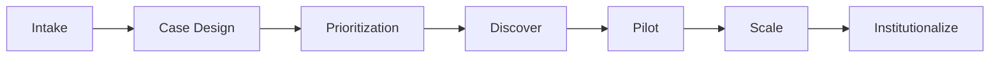

# AI CoE Business Requirements and Case Design Rules

## Purpose

Give the Discount Tire AI Center of Excellence (CoE) a repeatable, pragmatic-but-ambitious way to originate, design, prioritize, and graduate AI use cases. This document sets the requirement and design rules a use case must satisfy to enter, advance through, and exit the CoE portfolio. It complements the enterprise specification in [01-foundation-governance.md](01-foundation-governance.md) (mandatory controls, ownership, requirement taxonomy) and the business initiative catalog in the same document — this document is the *process and design-rule layer* that decides which initiatives get funded, how they are scoped, and when they are allowed to scale.

This is reference/target-state guidance for CoE operating practice, not a description of shipped application behavior. Current implemented capability remains authoritative in the [product guide](../product/README.md) and [architecture guide](../architecture/README.md).

## Operating Principles

1. **Pragmatic by default, ambitious by allocation.** Most of the portfolio should be near-term, low-risk, high-confidence wins built on already-governed data and tools. A deliberate minority slice is reserved for higher-risk, higher-upside bets — see [Portfolio Balance Rule](#portfolio-balance-rule).
2. **Reuse before build.** A new case must first check whether an existing subagent, Genie space, AI Search index, Metric View, or Lakebase route already covers the need (see [Tool and model registry](../architecture/tool-and-model-registry.md)) before requesting a new integration.
3. **Governed by default.** Every case inherits the requirement taxonomy (BR/AR/FR/DR/SR/RR/OR/CR/AC) from [01-foundation-governance.md](01-foundation-governance.md) section "0B" — a case cannot skip security, data, or operational ownership because it is "just a pilot."
4. **Evidence before scale.** A case does not move from Pilot to Scale without measured KPI evidence, not stakeholder confidence alone.
5. **Kill fast, cheaply.** Discovery and Pilot stages must be cheap enough that stopping a case is a non-event, not a political cost.

## Business Requirement Rules for CoE Intake

A candidate use case is not accepted into the CoE backlog until it has:

- **BR-CoE-1 (Value hypothesis):** A named business sponsor, a target KPI, and a stated baseline-to-target delta (e.g., "reduce appointment no-show rate from 18% to 12%").
- **BR-CoE-2 (Data readiness):** An identified data source with a data contract or a documented plan to create one (see [Data contracts and lineage](../governance/data-contracts-lineage.md)). No case starts with "we'll figure out the data later."
- **BR-CoE-3 (Risk classification):** A stated data classification, customer-impact level, and automation level (advisory, human-in-the-loop, or autonomous) per the [01-foundation-governance.md](01-foundation-governance.md) risk classification rule.
- **BR-CoE-4 (Capability mapping):** A stated primary capability pattern — RAG/search, Genie/structured analytics, predictive ML, or agentic orchestration — with rationale for why that pattern fits the problem, not the newest available technology.
- **BR-CoE-5 (Reuse check):** An explicit statement of what existing registered tool/subagent/index/Metric View was evaluated for reuse and why it is or isn't sufficient.
- **BR-CoE-6 (Exit criteria):** A stated Discovery exit KPI, Pilot exit KPI, and Scale exit KPI, defined before Discovery starts, not invented retroactively.

Cases missing any of BR-CoE-1 through BR-CoE-6 are returned to the sponsor for rework, not accepted "conditionally."

## Case Design Rules

When writing a case (charter/one-pager), require:

1. **Problem statement in one paragraph, in business language**, not a solution description. ("Customers abandon tire fitment search due to unclear compatibility" — not "we need a RAG chatbot.")
2. **Target KPI and measurement method** — must be measurable with data the business already collects or can reasonably instrument within the Discovery stage.
3. **Capability pattern and governed building blocks** the case expects to use (existing Genie space, AI Search index, Lakebase route, new Metric View, etc.), scoped against the [tool and model registry](../architecture/tool-and-model-registry.md).
4. **Ambition tier** (see below) and the specific reason the case is pragmatic or ambitious — cases must not default to "ambitious" just to sound strategic.
5. **Guardrail and evidence requirements** — whether the case's answers require citations/evidence (`requires_evidence`), and what persona/auth-mode boundaries apply, per [prompt-policy-controls.md](../governance/prompt-policy-controls.md).
6. **Kill criteria** — the specific signal that ends the case at Discovery or Pilot (e.g., "if data quality checks show >15% missing appointment-store linkage, stop").
7. **Owner assignment** across the seven CoE governance roles in [01-foundation-governance.md](01-foundation-governance.md) section "0A" (Executive Sponsor, Business Product Owner, Technical Owner, Data Owner, Security Owner, Model Owner, Operations Owner) before Pilot begins.

## Ambition Tiers

| Tier | Definition | Typical Pattern | Time-to-first-signal | Example |
| --- | --- | --- | --- | --- |
| **Pragmatic (Tier 1)** | Extends an existing governed capability to a new question set or persona. Low integration risk, fast time-to-value. | New Genie question coverage, new AI Search index over existing gold tables, new Metric View. | 2-4 weeks | Extend `sales_insights_agent` coverage to margin-by-region questions. |
| **Stretch (Tier 2)** | Combines existing capabilities in a new way, or adds one new governed integration. Moderate risk. | Cross-tool composite reasoning (see [context-engineering-guidelines.md](../governance/context-engineering-guidelines.md) Rule 7), a new Lakebase-backed subagent over an already-approved database. | 4-8 weeks | Cross-reference top appointment-volume stores against top sales-performing stores in one governed answer. |
| **Ambitious (Tier 3)** | Requires new predictive/ML capability, new data domain onboarding, or a new automation level (e.g., advisory to human-in-the-loop-action). Higher risk, requires an explicit executive risk acceptance. | Predictive maintenance/service reminders, dynamic pricing simulation, agentic incident drafting with approval gates. | 8-16 weeks to first measurable pilot signal | Proactive tire-wear/service-reminder assistant using mileage and service-history models. |

Tier 3 cases must reference the workflow patterns already sketched in [07-use-case-workflows.md](07-use-case-workflows.md) rather than inventing a new architecture pattern from scratch.

## Portfolio Balance Rule

To stay pragmatic while still being "a little more ambitious," the CoE backlog for any planning quarter should target this rough split of active capacity:

- **60-70% Tier 1 (Pragmatic):** Compounding, low-risk extensions that keep stakeholder trust and fund the CoE's credibility.
- **20-30% Tier 2 (Stretch):** Composite/cross-tool capabilities that differentiate the assistant without requiring new automation-risk approval.
- **10-15% Tier 3 (Ambitious):** At most one or two active Tier 3 bets at a time, each with an executive risk acceptance on file and an explicit Discovery-stage kill date.

If Tier 3 work exceeds 15% of active capacity, the CoE lead must flag portfolio risk to the Executive Sponsor before adding new Tier 3 work.

## Stage Gates

| Stage | Entry Requirement | Exit Requirement | Typical Duration |
| --- | --- | --- | --- |
| **Discover** | BR-CoE-1 through BR-CoE-6 satisfied; owner list drafted. | Data readiness confirmed or a signed data contract; capability pattern validated against a small sample; kill/continue decision documented. | 1-3 weeks |
| **Pilot** | Discover exit criteria met; all seven governance roles assigned. | Measured KPI movement on a bounded population/time window; guardrail and evidence checks passing; no unresolved security/risk exceptions. | 3-8 weeks |
| **Scale** | Pilot KPI evidence meets the release-gate thresholds in [evaluation-spec.md](../quality/evaluation-spec.md). | Production deployment through the standard `dev`/`qa`/`stg`/`prd` promotion path; lifecycle audit events flowing; operational runbook in place. | Ongoing |
| **Institutionalize** | Scale stable for one full reporting cycle. | Capability registered as a reusable building block (subagent, index, Metric View) in the [tool and model registry](../architecture/tool-and-model-registry.md) so future cases can reuse it under Tier 1. | Ongoing |

A case cannot skip a stage gate "because the sponsor is confident" — skipped gates must be logged as an explicit, executive-approved risk acceptance, not a silent shortcut.

## Anti-Patterns

- Writing a case around a specific model/vendor instead of a business outcome.
- Treating every case as "strategic" so nothing is prioritized against another.
- Starting a Tier 3 case without an executive risk acceptance and a kill date.
- Letting a Pilot run indefinitely without a Scale/kill decision.
- Building a bespoke integration when an existing governed subagent/index/Metric View already covers the need.
- Approving a case with unresolved BR-CoE-1 through BR-CoE-6 gaps because "the team will fill it in later."

## Related Documents

- [01-foundation-governance.md](01-foundation-governance.md)
- [07-use-case-workflows.md](07-use-case-workflows.md)
- [../product/business-specs.md](../product/business-specs.md)
- [../governance/prompt-policy-controls.md](../governance/prompt-policy-controls.md)
- [../governance/context-engineering-guidelines.md](../governance/context-engineering-guidelines.md)
- [../architecture/tool-and-model-registry.md](../architecture/tool-and-model-registry.md)
- [../quality/evaluation-spec.md](../quality/evaluation-spec.md)
