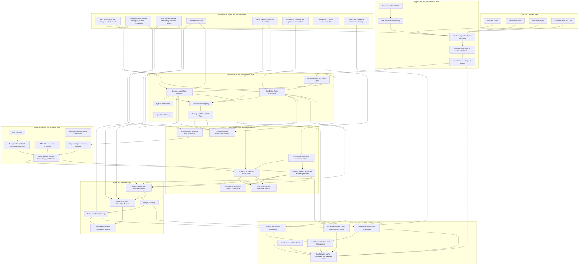

# AI Systems Architecture Diagram

The diagram represents a current AWS and Databricks hybrid architecture for governed,
tool-using, retrieval-augmented AI systems. It treats **Amazon Bedrock AgentCore**
and the **Databricks Agent Framework** as complementary runtimes.

## Current platform notes

- **Amazon Bedrock AgentCore** provides modular Runtime, Gateway, Identity, Memory,
  Policy, Registry, and Observability capabilities for agents built with supported
  frameworks and models. AgentCore Gateway can expose APIs, Lambda functions, and
  existing MCP servers as agent tools.
- **Amazon Bedrock Managed Knowledge Bases** support managed ingestion, indexing,
  retrieval, multimodal data, agentic retrieval, document-level permission filtering,
  citations, and AgentCore Gateway and Observability integration.
- **Amazon Bedrock Guardrails** can filter harmful content, denied topics, custom
  words, sensitive information, ungrounded responses, and responses that fail
  configured automated-reasoning checks.
- **Databricks Agent Framework** remains the Databricks-native orchestration boundary,
  with Unity Catalog-backed tools and data permissions, AI Search or Vector Search,
  Model Serving, MLflow tracing and evaluation, and application-level guardrails.
- **Bedrock Agents Classic** should be shown only when maintaining an existing
  deployment; AWS documentation identifies it as unavailable to new customers and
  directs new implementations toward AgentCore.

## Reference documentation

- [Amazon Bedrock AgentCore](https://docs.aws.amazon.com/bedrock-agentcore/latest/devguide/what-is-bedrock-agentcore.html)
- [Amazon Bedrock Guardrails](https://docs.aws.amazon.com/bedrock/latest/userguide/guardrails.html)
- [Amazon Bedrock Knowledge Bases](https://docs.aws.amazon.com/bedrock/latest/userguide/knowledge-base.html)
- [Databricks AI and machine learning](https://docs.databricks.com/aws/en/machine-learning/)