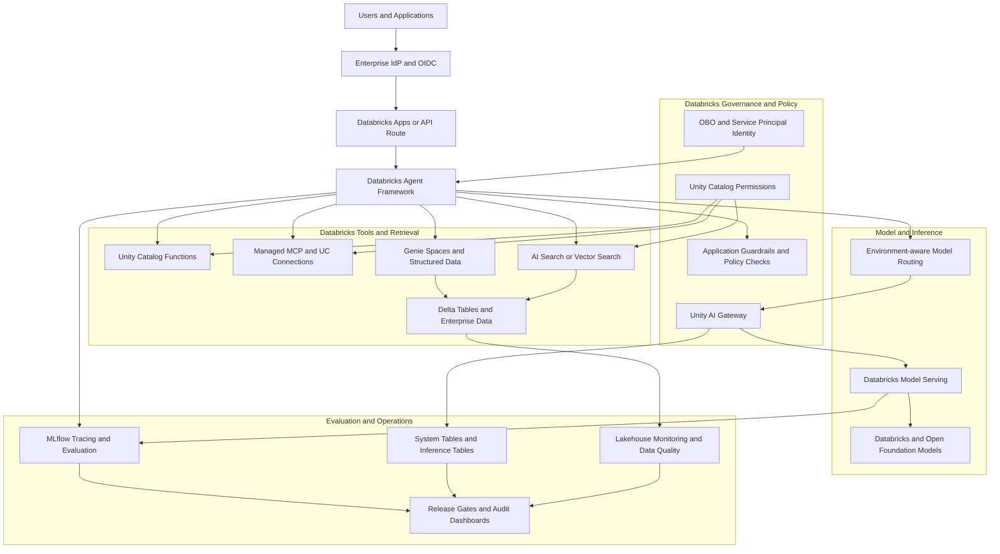
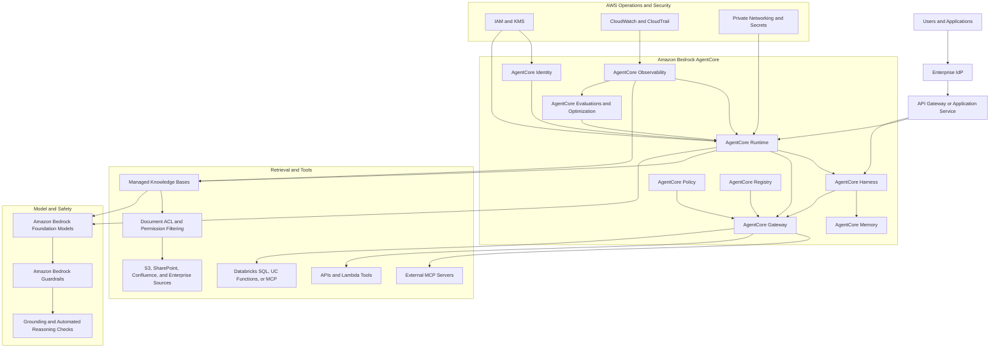

# AI Systems Architecture Diagrams

The following views separate the two primary deployment patterns: a Databricks-native
AI system and an AWS Bedrock AgentCore AI system that can use Databricks data.

## 1. Databricks-native governed AI system

Use this architecture when orchestration, data permissions, retrieval, model serving,
evaluation, and audit should remain primarily inside Databricks and Unity Catalog.

## 2. AWS Bedrock AgentCore AI system

Use this architecture when the agent runtime, tool gateway, identity, memory,
policy, and operational controls should be primarily provided by AWS, while the
agent can still retrieve from Databricks or other enterprise data sources.

## Architecture selection

| Concern | Databricks-native system | AWS AgentCore system |
| --- | --- | --- |
| Primary agent runtime | Databricks Agent Framework | AgentCore Runtime or Harness |
| Data governance anchor | Unity Catalog | IAM, AgentCore Identity, and source ACLs |
| Retrieval | AI Search, Vector Search, Genie, and Delta | Managed Knowledge Bases, MCP, and enterprise connectors |
| Model access | Model Serving and Unity AI Gateway | Amazon Bedrock foundation models |
| Tool integration | UC Functions, managed MCP, and connections | AgentCore Gateway, APIs, Lambda, and MCP |
| Evaluation and tracing | MLflow, System Tables, and Lakehouse Monitoring | AgentCore Observability, Evaluations, CloudWatch, and CloudTrail |
| Best fit | Lakehouse-first governed AI | AWS-native agent operations and multi-framework agents |

## Shared design requirements

Both architectures should enforce identity-aware tool access, retrieval permissions,
input and output guardrails, model and prompt versioning, traceability, evaluation,
release gates, and auditable production operations.

## Reference documentation

- [Amazon Bedrock AgentCore](https://docs.aws.amazon.com/bedrock-agentcore/latest/devguide/what-is-bedrock-agentcore.html)
- [Amazon Bedrock Guardrails](https://docs.aws.amazon.com/bedrock/latest/userguide/guardrails.html)
- [Amazon Bedrock Knowledge Bases](https://docs.aws.amazon.com/bedrock/latest/userguide/knowledge-base.html)
- [Databricks AI and machine learning](https://docs.databricks.com/aws/en/machine-learning/)